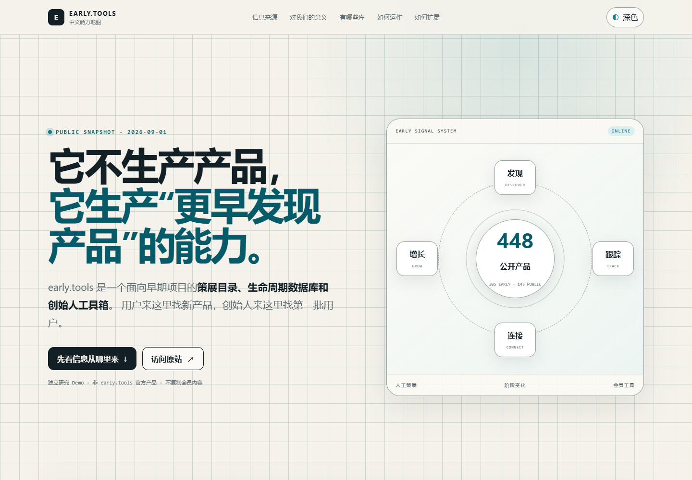
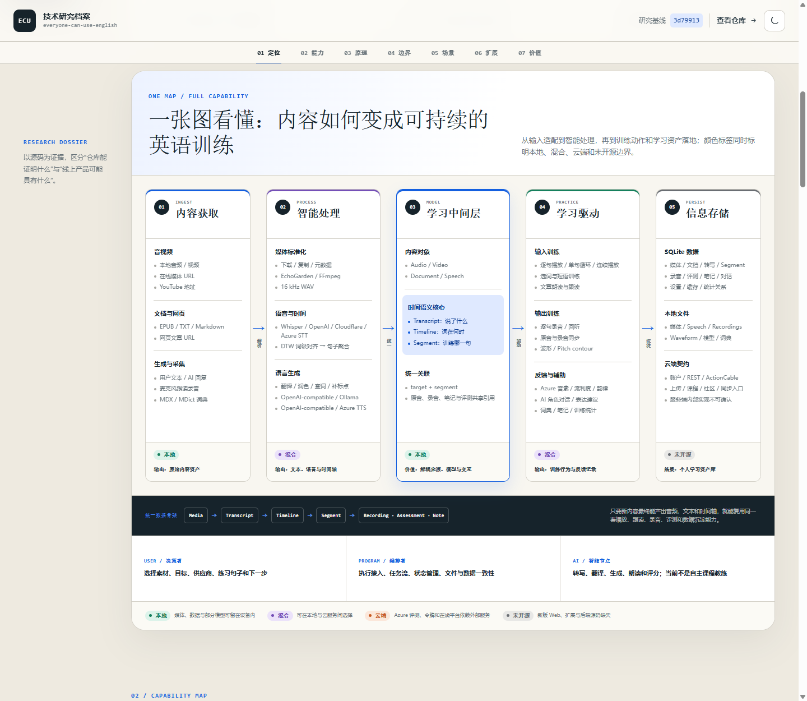

# 0831 Codex Project

> 一个用于研究优秀 GitHub 开源项目、沉淀可复用结论并展示验证型 Demo 的总项目库。

本仓库聚焦于项目的设计思路、架构取舍、关键实现和可复用经验。每个研究条目都会记录上游来源、研究基线与许可证；必要时可附带最小实验或静态 Web Demo，但不会默认镜像完整的第三方仓库。

[在线展厅](https://yydshly.github.io/0831_codex_project/) · [研究索引](#研究索引) · [Web Demo 索引](#web-demo-索引) · [新增项目约定](CONTRIBUTING.md)

## 精选展示

点击展示图进入对应的在线 Demo。这里保留少量代表性入口，完整清单以有序索引为准。

<table>
  <tr>
    <td width="33%" valign="top">
      <a href="https://yydshly.github.io/0831_codex_project/demos/botvod-capability-lab/"></a><br />
      <strong>001 · BotVod + MediaCMS</strong><br />
      <sub>从 URL 摄取到媒体资产管理的系统边界。</sub>
    </td>
    <td width="33%" valign="top">
      <a href="https://yydshly.github.io/0831_codex_project/demos/early-tools-capability-lab/"></a><br />
      <strong>003 · early.tools</strong><br />
      <sub>早期产品发现、策展与持续跟踪。</sub>
    </td>
    <td width="33%" valign="top">
      <a href="https://yydshly.github.io/0831_codex_project/demos/everyone-can-use-english-capability-lab/"></a><br />
      <strong>002 · Everyone Can Use English</strong><br />
      <sub>内容如何转化为可持续的英语训练。</sub>
    </td>
  </tr>
</table>

## 研究索引

| 编号 | 研究项目 | 上游仓库 | 研究重点 | 状态 | 研究笔记 | Demo | 最近更新 |
| --- | --- | --- | --- | --- | --- | --- | --- |
| `001` | BotVod + MediaCMS 对照研究 | [BotVod](https://botvod.com/) · [MediaCMS](https://github.com/mediacms-io/mediacms) | 上游 URL 媒体摄取与下游资产管理分发如何通过 Source Adapter 和统一 Manifest 连接 | `validated` | [研究笔记](research/botvod-com/README.md) | [在线 Demo](https://yydshly.github.io/0831_codex_project/demos/botvod-capability-lab/) | 2026-09-01 |
| `002` | Everyone Can Use English / Enjoy | [GitHub](https://github.com/ZuodaoTech/everyone-can-use-english) | 把任意内容加工成英语训练材料的工作台；研究内容接入、STT、DTW 时间轴、跟读反馈、AI 节点和本地学习资产 | `studying` | [研究笔记](research/zuodaotech-everyone-can-use-english/README.md) | [在线 Demo](https://yydshly.github.io/0831_codex_project/demos/everyone-can-use-english-capability-lab/) | 2026-09-01 |
| `003` | early.tools | [在线网页](https://www.early.tools/) | 将分散的早期产品线索策展为可筛选、可持续跟踪的产品情报，帮助用户更早发现机会，并帮助创始人完成验证与分发 | `validated` | [研究笔记](research/early-tools/README.md) | [在线 Demo](https://yydshly.github.io/0831_codex_project/demos/early-tools-capability-lab/) | 2026-09-01 |
| `004` | Microduck 机器人与强化学习 | [microduck](https://github.com/pollen-robotics/microduck) · [microduck_rl](https://github.com/pollen-robotics/microduck_rl) | 从 MuJoCo/PPO/Sim2Real 到 50 Hz 实机运行时的完整链路，以及能力边界和研究价值 | `studying` | [研究笔记](research/pollen-robotics-microduck/README.md) | [官方模拟器](https://huggingface.co/spaces/pollen-robotics/microduck-simulator) | 2026-09-01 |
| `005` | XPADE Face Liquify | [在线网页](https://xpade.dothome.co.kr/) | 浏览器端人脸关键点、网格液化与本地导出，并扩展为企业职业头像业务演示 | `validated` | [研究笔记](research/xpade-face-liquify/README.md) | [在线 Demo](https://yydshly.github.io/0831_codex_project/demos/xpade-face-liquify-lab/) | 2026-09-01 |
| `006` | RealHuman 场景产品中心 V2 | [XPADE V1 研究](research/xpade-face-liquify/README.md) | 将人脸几何研究扩展为照片精修、实时摄像头增强、老照片基础修复与产品场景编排；明确区分已实现底座和待接专用模型 | `validated` | [V2 产品化记录](research/realhuman-scenario-showcase/README.md) | [总览](https://yydshly.github.io/0831_codex_project/demos/realhuman-scenario-showcase/) · [照片](https://yydshly.github.io/0831_codex_project/demos/realhuman-scenario-showcase/photo.html) · [视频](https://yydshly.github.io/0831_codex_project/demos/realhuman-scenario-showcase/video.html) · [扩展](https://yydshly.github.io/0831_codex_project/demos/realhuman-scenario-showcase/extensions.html) | 2026-09-03 |
| `007` | Write Then Publish | [GitHub](https://github.com/fxyadela/write-then-publish) | Markdown 单一内容源、多形态排版、媒体处理与发布前交付 | `validated` | [研究笔记](research/fxyadela-write-then-publish/README.md) | [在线研究档案](https://yydshly.github.io/0831_codex_project/demos/write-then-publish-lab/) | 2026-09-01 |
| `008` | OpenBrowser | [GitHub](https://github.com/lyu0805/OpenBrowser) | 真实 Chromium 之上的 Profile 隔离、CDP、RPA 状态流与 MCP 控制面 | `studying` | [研究笔记](research/lyu0805-openbrowser/README.md) | [在线 Demo](https://yydshly.github.io/0831_codex_project/demos/openbrowser-architecture-lab/) | 2026-09-01 |
| `009` | OPC Skills | [GitHub](https://github.com/ReScienceLab/opc-skills) | 用同一方法探索多个真实候选，把外部证据、Agent 整理、个人认知和行动反馈改写成自己的创业操作系统 | `validated` | [研究笔记](research/resciencelab-opc-skills/README.md) | [在线 Demo](https://yydshly.github.io/0831_codex_project/demos/opc-skills-capability-lab/) | 2026-09-01 |

> 三位编号是稳定研究 ID，只增不改、不因展示优先级而重排。单仓研究默认使用 `owner-repository` 目录名，多来源或主题研究使用已说明来源的稳定 `kebab-case` slug。研究状态统一使用 `planned`、`studying`、`validated` 或 `archived`。

## Web Demo 索引

| 研究编号 | Demo | 关联研究 | 简介 | 在线地址 | 源码 | 状态 |
| --- | --- | --- | --- | --- | --- | --- |
| `001` | BotVod Capability Lab | [BotVod + MediaCMS 对照研究](research/botvod-com/README.md) | 演示 URL 找源与缓存/队列，并用系统全景解释 MediaCMS 的存储、处理、管理、分发和展示职责 | [在线访问](https://yydshly.github.io/0831_codex_project/demos/botvod-capability-lab/) | [源码](apps/botvod-capability-lab/) | `validated` |
| `002` | Everyone Can Use English 技术能力图谱 | [Everyone Can Use English / Enjoy](research/zuodaotech-everyone-can-use-english/README.md) | 用五阶段全景和 12 项能力解释内容如何经过 AI 与语音处理，成为可播放、跟读、录音、评测和沉淀的训练材料 | [在线访问](https://yydshly.github.io/0831_codex_project/demos/everyone-can-use-english-capability-lab/) | [源码](apps/everyone-can-use-english-capability-lab/) | `validated` |
| `003` | early.tools 中文能力地图 | [early.tools](research/early-tools/README.md) | 从五类信息来源和来源处理链出发，按角色与七类能力库解释早期产品发现、策展飞轮、使用边界和扩展路线 | [在线访问](https://yydshly.github.io/0831_codex_project/demos/early-tools-capability-lab/) | [源码](apps/early-tools-capability-lab/) | `validated` |
| `005` | XPADE Face Liquify Capability Lab | [XPADE Face Liquify](research/xpade-face-liquify/README.md) | 以原创合成肖像演示语义人脸变形、职业头像业务闭环，并解释当前几何库与产品层能力的关系 | [在线访问](https://yydshly.github.io/0831_codex_project/demos/xpade-face-liquify-lab/) | [源码](apps/xpade-face-liquify-lab/) | `validated` |
| `006` | RealHuman 场景产品中心 V2 | [V2 产品化记录](research/realhuman-scenario-showcase/README.md) | 在 V1 研究结论之上，以照片、实时视频和扩展产品场景组织真实本地能力；V1 页面及地址继续独立保留 | [总览](https://yydshly.github.io/0831_codex_project/demos/realhuman-scenario-showcase/) · [照片](https://yydshly.github.io/0831_codex_project/demos/realhuman-scenario-showcase/photo.html) · [视频](https://yydshly.github.io/0831_codex_project/demos/realhuman-scenario-showcase/video.html) · [扩展](https://yydshly.github.io/0831_codex_project/demos/realhuman-scenario-showcase/extensions.html) | [源码](apps/realhuman-scenario-showcase/) | `validated` |
| `007` | Write Then Publish 独立研究档案 | [Write Then Publish](research/fxyadela-write-then-publish/README.md) | 总结“一次输入、统一处理、按平台编译、分别交付”，关联上游真实卡片/长文 PNG，并用教学实验解释同源双输出 | [在线 Demo](https://yydshly.github.io/0831_codex_project/demos/write-then-publish-lab/) | [源码](apps/write-then-publish-lab/) | `validated` |
| `008` | OpenBrowser 原理与后期价值地图 | [OpenBrowser](research/lyu0805-openbrowser/README.md) | 区分浏览器内核与运行平台，交互拆解 Profile、CDP、RPA、MCP、隔离边界和未来研究触发条件 | [在线访问](https://yydshly.github.io/0831_codex_project/demos/openbrowser-architecture-lab/) | [源码](apps/openbrowser-architecture-lab/) | `validated` |
| `009` | OPC Skills 能力与方法地图 | [OPC Skills](research/resciencelab-opc-skills/README.md) | 用多项目探索循环解释十个 Skills、个人决策门，并回放“想法—探索—取证—纠偏—沉淀”的真实研究轨迹及其原始证据 | [在线访问](https://yydshly.github.io/0831_codex_project/demos/opc-skills-capability-lab/) | [源码](apps/opc-skills-capability-lab/) | `validated` |

Web Demo 已统一汇总到同一个 GitHub Pages 站点，并通过独立子路径访问。具体约定见 [apps/README.md](apps/README.md)。

## 仓库结构

```text
.
├─ research/              # 研究条目、笔记、实验与补丁
│  └─ _template/          # 新研究条目的起始模板
├─ apps/                  # 可选的独立 Web Demo
├─ site/                  # GitHub Pages 总入口
├─ .github/workflows/     # 单一 Pages 聚合发布流程
├─ CONTRIBUTING.md        # 新增研究与 Demo 的操作约定
└─ README.md              # 对外摘要与总索引
```

- [研究区说明](research/README.md)
- [研究条目模板](research/_template/README.md)
- [Web Demo 约定](apps/README.md)
- [贡献与维护指南](CONTRIBUTING.md)

## 来源与许可证

第三方项目、代码片段、截图和其他素材仍受其各自许可证与权利声明约束。每个研究条目必须清楚标注上游仓库、研究基线和上游许可证。

本仓库目前未设置统一的开源许可证；后续会根据原创内容与第三方材料的边界单独确定。仓库中的研究观点不代表上游项目或其维护者。
