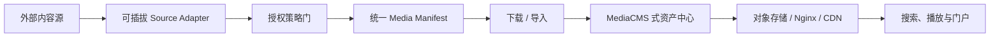
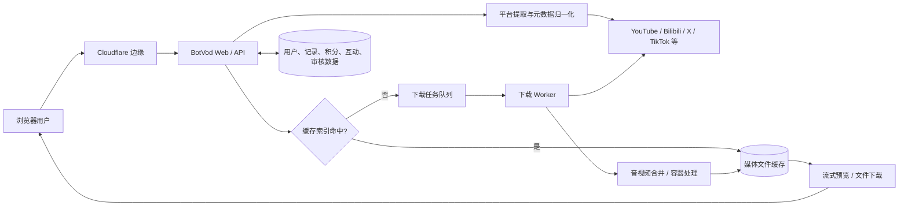
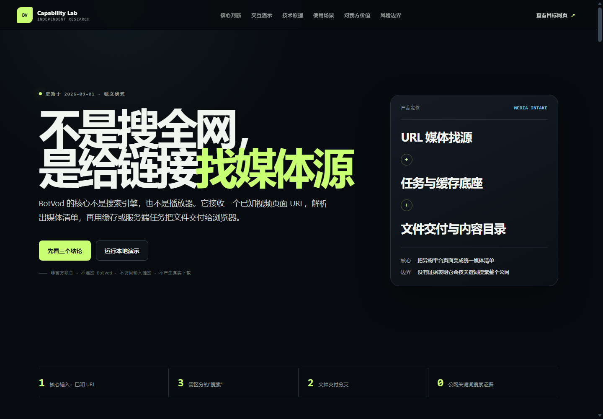

# BotVod 系统研究

> 一句话：**BotVod 是把已知 URL 变成媒体资产的上游摄取样本，MediaCMS 是管理并分发已入库媒体的下游资产样本；我们应以可插拔 Source Adapter 与统一 Media Manifest 把两层连接起来。**

BotVod 不是 AI 视频生成工具，也没有证据表明它是公网视频搜索引擎。更准确的定位是“已知 URL 媒体找源 + 服务端下载队列 + 共享缓存 + 轻社区”。本研究同时用 MediaCMS 对照媒体进入系统后的存储、处理、管理、分发与展示职责。

## 项目信息

| 字段 | 内容 |
| --- | --- |
| 上游系统 | [https://botvod.com/](https://botvod.com/) |
| 研究对象 | 在线网站与其公开页面、公开 API、浏览器前端资源 |
| 研究基线 | 2026-09-01 黑盒观察；网站无公开版本号 |
| 源码可用性 | 未发现公开服务端源码；实现原理为证据约束下的黑盒推断 |
| 上游许可证 | 未公开；不能将网页代码或媒体缓存视为开源资产 |
| 研究状态 | `validated`（能力与公开接口）；内部技术栈仍为 `inferred` |
| 首次研究 | 2026-08-31 |
| 最近更新 | 2026-09-01 |
| 标签 | `media-pipeline`、`source-adapter`、`media-manifest`、`asset-cms`、`queue`、`cache`、`privacy` |

## 先给结论

BotVod 的表层能力是“粘贴链接下载视频”，本质是 **URL 驱动的媒体摄取服务**：它不负责按关键词替用户搜索整个公网，而是从用户已知的视频页面中解析媒体清单。真正有研究价值的部分，是它把一次性找源改造成了中心化媒体管线：缓存命中时直接复用文件，未命中时进入受并发约束的后台队列；完成后的内容再进入站内搜索、榜单、播放、收藏和评论体系。

对我们的最佳价值不是直接依赖这个站点，而是学习并重建其中的三个模式：

1. **统一媒体清单**：把不同平台的标题、作者、封面、时长、音视频轨和容器格式归一化。
2. **缓存优先的异步管线**：先查重，未命中才创建任务；用状态机解释排队、下载、合并和交付。
3. **资产治理层**：在文件之外保存来源、授权、可见性、生命周期、下载历史和审计信息。

直接使用 BotVod 只适合低敏感、低频、已经获得授权的公开素材。它不适合作为企业核心链路，也不应接收我们的主账号 Cookie、私密链接或客户未发布内容。

关键技术判断是：如果已经取得稳定、授权、可直接访问的媒体对象，在线播放与文件下载属于成熟的交付层；真正决定平台覆盖和成功率的是前面的平台适配、媒体找源与格式归一化。

## 后期理解：从下载器扩展为完整媒体系统

MediaCMS 的对照让系统边界更加清楚：它不是任意网页下载器，而是媒体文件进入系统之后的 **资产管理 + 视频处理 + 分发源站 + 门户展示**。因此完整产品不应该把所有能力塞进一个“下载服务”，而应该分层：

- 上游决定覆盖范围：来源识别、页面解析、签名与凭证、媒体清单归一化。
- 中游决定可治理性：授权、审计、幂等任务、缓存、转码和资产生命周期。
- 下游决定使用体验：站内搜索、权限、播放、下载、分享、嵌入和门户展示。

完整的系统分层、MediaCMS 实现职责、转码流程和建设顺序见 [媒体平台全景](notes/media-platform-landscape.md)。

## 三个研究问题

### 1. 它具备什么能力，适合什么场景？

- 解析 YouTube、Bilibili、TikTok、X、Instagram 等平台链接，当前公开缓存还出现了抖音与其他来源。
- 展示标题、作者、封面、时长以及完整视频、纯视频、纯音频等格式。
- 服务端异步下载、进度查询、音视频处理、缓存复用与浏览器文件交付。
- 站内缓存内容搜索、网页预览、榜单、收藏、评论、分享、举报、积分与等级；没有观察到全网关键词视频搜索。
- 注册、邮箱验证、下载记录、分组、通知、签到、推荐和 Cookie 绑定。

详细能力矩阵、额度快照和场景边界见 [能力与使用场景](notes/capabilities-and-use-cases.md)。

### 2. 它可能如何实现？

图中浏览器、公开 API、缓存、队列、进度和文件交付均有公开证据；具体提取器、数据库产品、队列产品和合并工具没有服务端源码证明，因此只描述职责，不冒充已知实现。完整架构、时序、状态机、概念数据模型和 API 面见 [实现原理与架构](notes/architecture.md)。

### 3. 它对我们有什么价值？

- **产品价值高**：格式选择、缓存复用、可解释队列和资产发现形成完整用户闭环。
- **工程参考价值高**：适合研究异步任务、幂等缓存键、多标签页进度复用和媒体轨道归一化。
- **直接供应商价值低**：缺少公开主体、隐私政策、服务条款、SLA 与稳定 API，且存在 Cookie 与公共缓存风险。
- **内部重建价值中高**：若限定为已授权素材，并加入策略门、默认私密、审计与生命周期管理，可发展为内部媒体采集入口。

详细的价值分层、决策树和实施路线见 [对我们的价值](notes/value-assessment.md)。

## 阅读导航

| 文档 | 回答的问题 |
| --- | --- |
| [能力与使用场景](notes/capabilities-and-use-cases.md) | 能做什么、额度和边界是什么、谁适合用 |
| [实现原理与架构](notes/architecture.md) | 请求、缓存、队列、Worker、交付和数据如何协作 |
| [媒体平台全景](notes/media-platform-landscape.md) | BotVod、我们的适配层、MediaCMS 与 CDN 如何分工和组合 |
| [对我们的价值](notes/value-assessment.md) | 应该直接使用、借鉴模式还是内部重建 |
| [证据与风险](notes/evidence-and-risks.md) | 哪些是事实、哪些是推断、风险如何控制 |
| [Capability Lab](../../apps/botvod-capability-lab/) | 不访问真实媒体的本地交互演示 |
| [验证记录](notes/validation.md) | 构建、浏览器与文档检查结果 |

## 研究方法与边界

- 只读取公开页面、HTTP 响应、公开配置/API、前端 JavaScript 和权威 RDAP。
- 没有注册账号、上传 Cookie、提交下载任务或抓取第三方媒体。
- 未保存公共缓存中的标题、用户昵称、源链接或媒体内容，只保存聚合统计。
- “观察”表示公开页面或接口可直接证实；“推断”表示由请求结构和状态语义支持，但没有服务端源码；“建议”是我们自己的设计判断。

## Demo

[BotVod Capability Lab](../../apps/botvod-capability-lab/) 是一个独立的 Vite + TypeScript 本地演示。它用固定数据复现链接识别、格式清单、缓存命中、队列处理和交付状态机，并用媒体系统全景解释 MediaCMS 的下游职责；不调用 BotVod 或视频平台接口，也不会生成媒体文件。

- [在线访问 Capability Lab](https://yydshly.github.io/0831_codex_project/demos/botvod-capability-lab/)

## 主要来源

- [BotVod 首页](https://botvod.com/)
- [BotVod 缓存区](https://botvod.com/cache)
- [BotVod 登录页](https://botvod.com/login)
- [公开站点配置](https://botvod.com/api/site/config)
- [公开等级配置](https://botvod.com/api/levels)
- [前端应用代码](https://botvod.com/static/js/app.js?v=88063569)
- [前端中英文规则](https://botvod.com/static/js/i18n.js?v=88063569)
- [Verisign RDAP](https://rdap.verisign.com/com/v1/domain/BOTVOD.COM)
- [YouTube 服务条款](https://www.youtube.com/static?template=terms)
- [MediaCMS 官方仓库](https://github.com/mediacms-io/mediacms)
- [MediaCMS 开发者文档](https://github.com/mediacms-io/mediacms/blob/main/docs/developers_docs.md)
- [MediaCMS Docker Compose](https://github.com/mediacms-io/mediacms/blob/main/docker-compose.yaml)

## 变更记录

- `2026-09-01`：将 MediaCMS 的存储、处理、管理、分发和展示能力纳入后期理解，形成 BotVod → Source Adapter → MediaCMS → CDN 的媒体系统全景，并发布到 GitHub Pages。
- `2026-09-01`：完成能力、场景、架构、流程、价值与风险研究；进一步明确“公网搜索、缓存检索、URL 找源”的边界，并重构 Capability Lab 核心页面。
- `2026-08-31`：建立研究和交互演示骨架。
