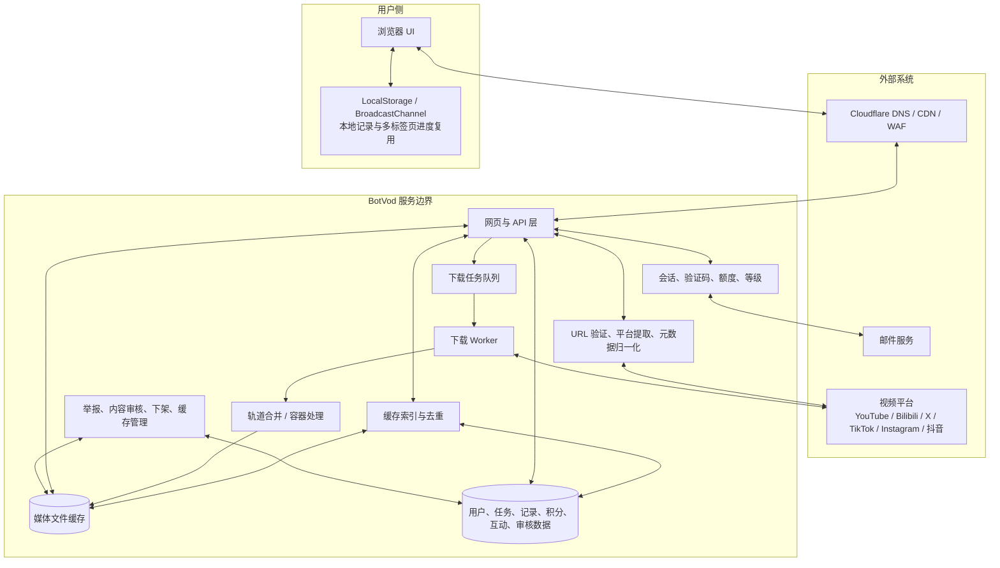
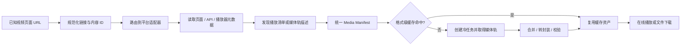
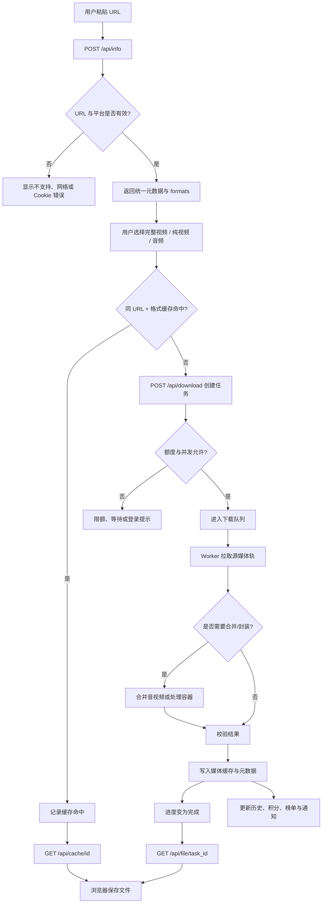
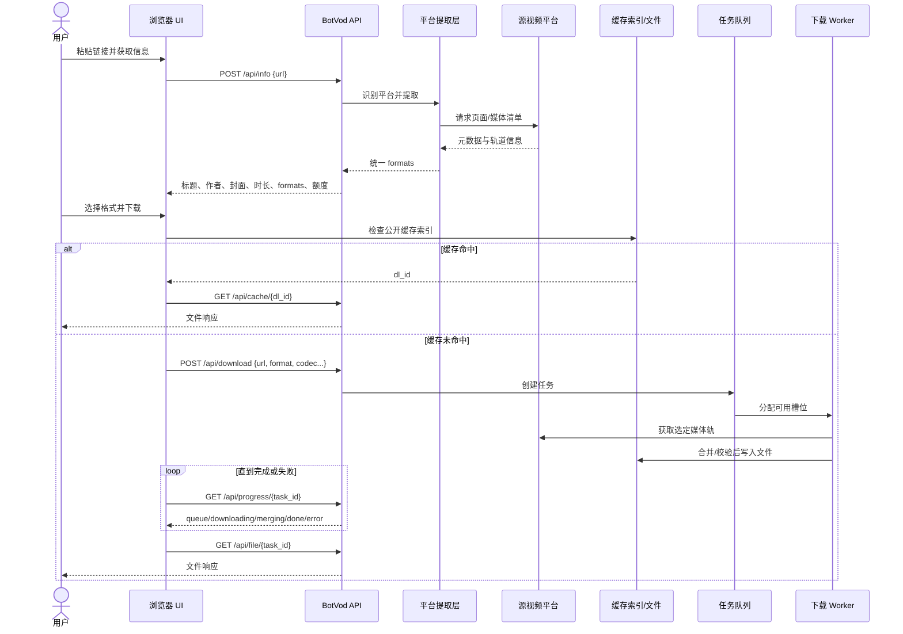
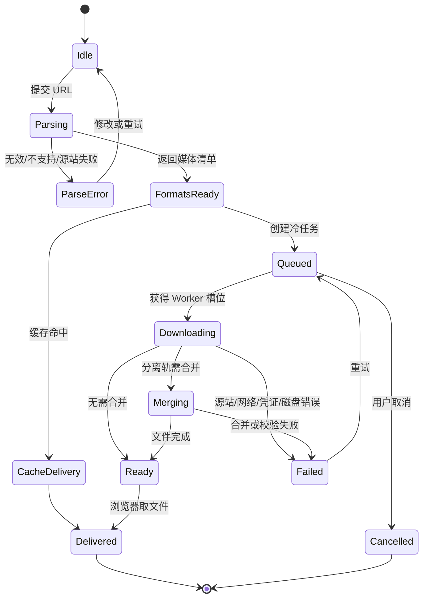
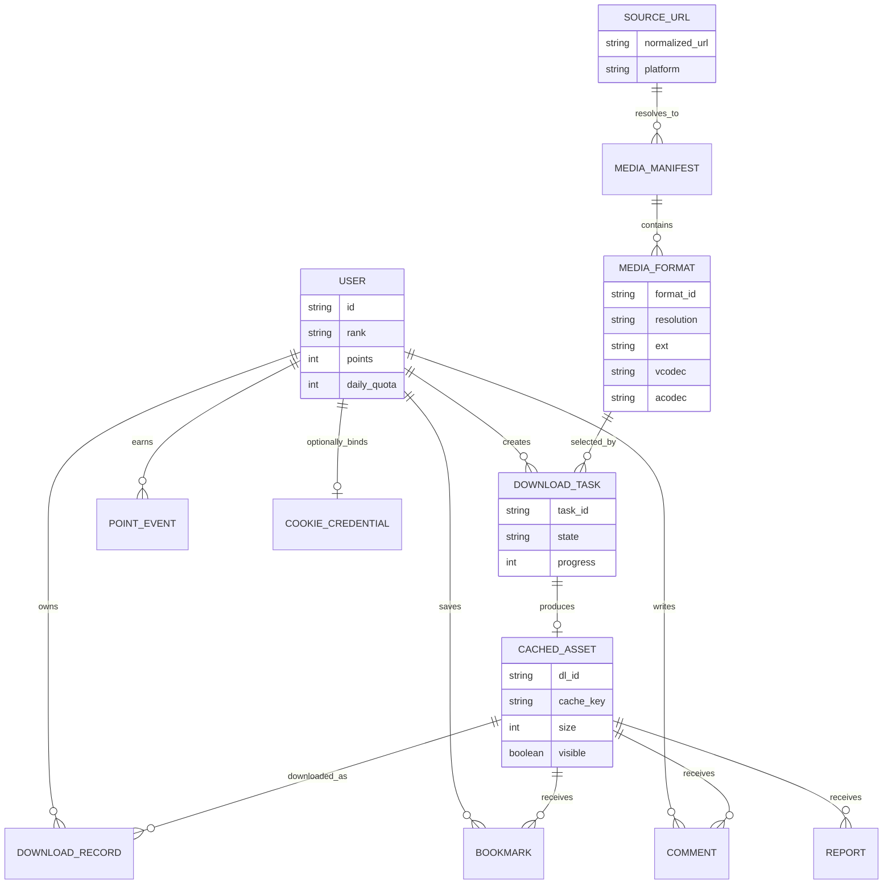

# 实现原理与架构

## 重要说明：这是黑盒架构研究

BotVod 没有公开服务端仓库。本文件根据公开页面、API 路径、请求参数、状态名称和前端行为整理“职责架构”。

- 可以确认：浏览器应用、REST 风格接口、服务端任务、队列/进度、缓存、文件流、账户、积分和审核面存在。
- 可以合理推断：有平台提取适配层、后台 Worker、媒体封装/合并步骤、文件存储和持久化数据库。
- 不能确认：服务端语言、框架、数据库品牌、队列产品、对象存储产品，以及是否直接采用 `yt-dlp`、FFmpeg 或其他具体实现。

## 系统上下文

### 各层职责

| 层 | 主要职责 | 公开证据 |
| --- | --- | --- |
| 浏览器 UI | 输入 URL、展示元数据和格式、轮询进度、播放、下载、互动 | 首页与公开前端代码 |
| 边缘层 | HTTPS、代理、基础安全头、隐藏源站 | HTTP 响应与 RDAP/DNS |
| Web/API | 会话、输入校验、业务路由、JSON 响应、文件交付 | `/api/*` 路径族 |
| 提取与归一化 | 将平台页面转换为统一媒体清单 | `/api/info` 返回字段与格式渲染逻辑 |
| 缓存索引 | 以规范化 URL 和格式特征查重 | `/api/cache/list`、前端 `fmtKeyOf`/URL 规范化 |
| 任务队列 | 控制并发、返回等待/运行状态、支持取消 | `/api/download`、`/api/queue`、`/api/cancel/*` |
| Worker | 从源站获取选择的媒体轨 | 进度、速度、错误和 Cookie 失效状态 |
| 媒体处理 | 合并视频/音频轨或整理容器 | “正在合成文件”状态与 `vcodec/acodec` 参数 |
| 文件缓存 | 直接下载、流式播放、容量限制和清理 | `/api/cache/{id}`、`/api/stream/{id}`、35 GB 配置 |
| 业务数据 | 历史、收藏、评论、积分、通知、排行榜 | 对应公开接口与控制台界面 |
| 审核管理 | 举报、屏蔽词、上下架、缓存修复和用户管理 | 前端暴露的管理员接口名称；权限受控 |

## 核心下载流程

### 找源流程：真正的能力上限

- `POST /api/info`、格式字段、缓存分支和任务状态可以公开观察。
- URL 规范化、平台适配器以及页面/API/播放器元数据的具体取得方式属于职责推断；BotVod 没有公开服务端源码。
- 不能据此断言它使用 `yt-dlp`、FFmpeg 或任何具体库；这些只能作为同类系统的可能实现选项。

### 为什么“找到源后，播放和下载就不是核心问题”基本成立

如果已经得到**稳定、授权、可直接访问的媒体对象**，在线播放通常可归结为 HTTP 流式响应与 Range 请求，下载通常可归结为文件响应与 `Content-Disposition`。这两类能力高度标准化，通常不是产品的核心壁垒。

但“找到源”不一定意味着拿到永久公开的 MP4。残余工程问题包括：

| 层级 | 典型问题 | 技术地位 |
| --- | --- | --- |
| 找源与归一化 | 平台页面变化、签名 URL、Cookie/Referer/Header、轨道语义、格式清单 | 核心壁垒，决定平台覆盖与成功率 |
| 缓存与任务治理 | 去重、队列、限流、重试、A/V 合并、缓存生命周期 | 工程底座，决定可靠性与成本 |
| 播放与下载 | HLS/DASH 分片、HTTP Range、容器/编码兼容、文件名与响应头 | 标准化交付层，决定使用体验 |

所以更严谨的结论是：**播放与下载更简单，但不是零问题；真正值得复用的能力是 `URL → Media Manifest → 可治理资产`。**

## 请求时序

## 前端任务状态机

## 概念数据模型

下面是为了说明职责而抽象的数据模型，不代表真实表名或数据库结构。

## 公开 API 面

| 领域 | 代表路径 | 用途 |
| --- | --- | --- |
| 解析 | `POST /api/info` | URL → 元数据与格式清单 |
| 下载 | `POST /api/download` | 创建冷启动任务或返回缓存命中 |
| 任务 | `GET /api/progress/{task}`、`GET /api/queue`、`POST /api/cancel/{task}` | 进度、排队与取消 |
| 文件 | `GET /api/file/{task}`、`GET /api/cache/{id}`、`GET /api/stream/{id}` | 任务文件、缓存文件与预览流 |
| 缓存与发现 | `/api/cache/list`、`/api/hot`、`/api/rank/all` | 公共内容目录和榜单 |
| 用户 | `/api/login`、`/api/register`、`/api/me`、`/api/profile` | 身份和资料 |
| 记录 | `/api/history`、`/api/downloads/history`、`/api/bookmarks` | 私人历史与收藏 |
| 社区 | `/api/comments/{id}`、`/api/share/{id}`、`/api/report` | 互动与治理 |
| 激励 | `/api/points`、`/api/checkin`、`/api/referral`、`/api/levels` | 积分、签到、推荐和等级 |
| 凭证 | `/api/cookies/me/*` | 用户自有平台 Cookie 管理 |
| 管理 | `/api/admin/*` | 用户、缓存、审核、日志、统计和配置 |

## 值得复用的工程模式

### 1. 规范化 URL 与格式缓存键

缓存键不能简单删除所有查询参数。YouTube 的 `v`、Bilibili 的 `BV` 或其他平台的视频标识必须保留，只应移除 `utm_*`、分享来源和会话追踪参数。格式键还要包含分辨率、容器和音视频轨信息，否则不同格式会误命中同一文件。

### 2. 缓存命中与冷启动共用一个交付契约

无论文件来自缓存还是 Worker，最终都应该落到统一的 `asset_id`、文件元数据和下载接口。这样前端不需要理解底层抓取方式，历史、权限和审计也能复用。

### 3. 后台状态必须可解释

至少区分 `queued`、`downloading`、`merging`、`ready`、`failed`、`cancelled`。只显示一个百分比无法解释排队和合并耗时，也不利于定位源站、磁盘、网络或封装失败。

### 4. 多标签页轮询去重

公开前端使用 `BroadcastChannel` 复用短时间内的进度和队列结果。这是低成本减轻轮询压力的好方法；更大规模时可升级为 SSE/WebSocket，但仍应保留断线后的 GET 恢复路径。

## 主要故障面

| 故障面 | 表现 | 我们重建时的处理 |
| --- | --- | --- |
| 平台页面变化 | 提取失败或 formats 为空 | 适配器版本化、契约测试、逐平台熔断 |
| 登录 Cookie 失效 | 受限内容无法解析 | 不接收个人 Cookie；改用受控服务账户或官方 API |
| 源站限流 | 排队长、429、速度骤降 | 速率限制、退避、来源级并发和清晰错误 |
| 格式分轨 | 下载后无声或需合并 | 明确轨道标签、自动配对与兼容性预检 |
| 缓存淘汰 | 历史记录存在但文件缺失 | 元数据与文件状态分离，允许重新生成 |
| Worker 崩溃 | 任务长期停在处理中 | 租约、心跳、幂等重试和死信队列 |
| 公共内容滥用 | 侵权、敏感或隐私内容进入榜单 | 默认私密、策略门、举报 SLA、指纹和下架记录 |
