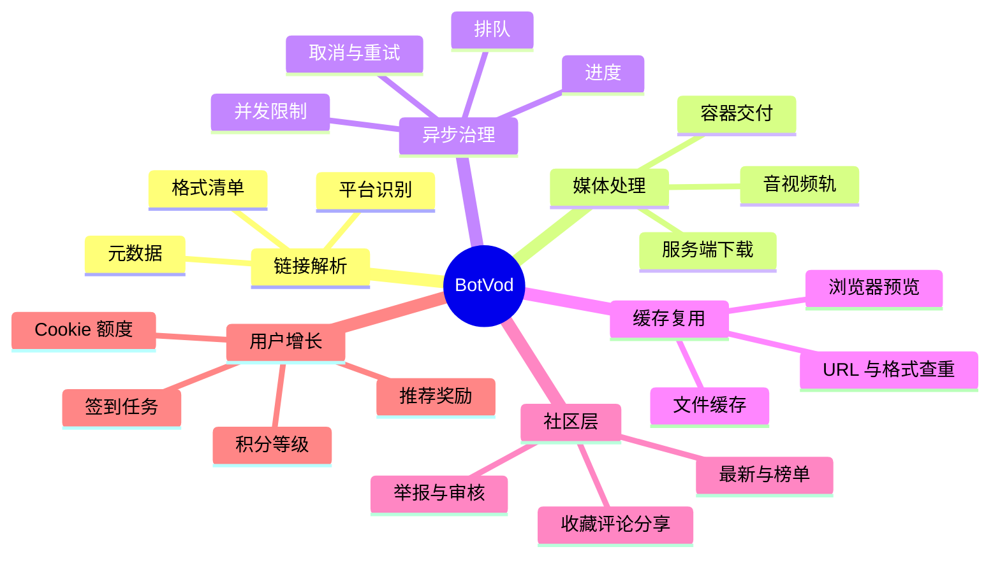
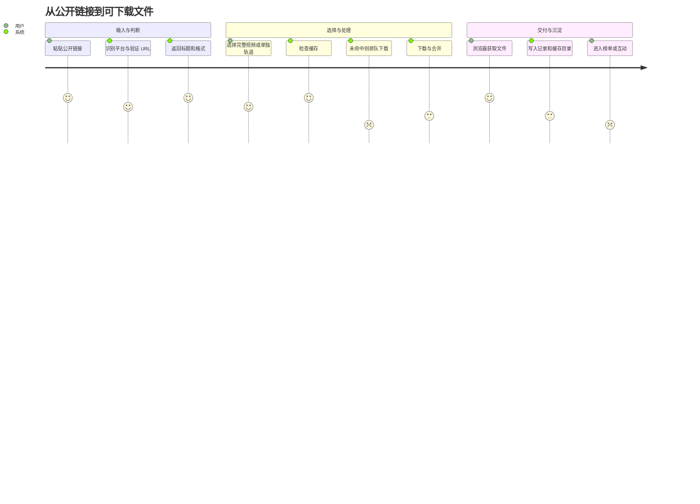

# 能力与使用场景

## 证据等级

| 等级 | 含义 |
| --- | --- |
| 公开观察 | 首页、缓存页、登录页或公开 API 当前可以直接看到 |
| 前端验证 | 公开 JavaScript 中存在完整请求、状态与界面处理逻辑 |
| 官网宣称 | 网站文案声明，但本研究没有执行真实下载验证 |
| 架构推断 | 由接口和状态支持的合理解释，不代表已知服务端技术栈 |

## 先回答：它是不是视频在线搜索下载？

**不准确。** 更准确的产品定位是：**URL 驱动的跨平台媒体解析与摄取服务**。它需要用户先提供一个已知视频页面 URL，再把页面解析成统一媒体清单，并通过缓存或服务端任务交付文件。

“搜索”必须拆成三种不同能力：

| 能力 | 输入 | 输出 | BotVod 判断 |
| --- | --- | --- | --- |
| 公网内容搜索 | 标题、主题、自然语言 | 来自全网的候选视频页面 | **没有公开证据**；不应把它称为视频搜索引擎 |
| 站内缓存检索 | 标题、作者、平台等条件 | BotVod 已解析、已缓存的资产 | **公开观察到**；属于内容目录与发现层 |
| 已知 URL 媒体找源 | 一个视频页面 URL | 元数据、格式/轨道清单及后续任务所需媒体信息 | **核心能力**；这才是它语境中的“找源” |

因此，它不是先替用户发现“哪里有这段视频”，而是先假设用户已经知道页面在哪里，再解决“这个页面背后有哪些媒体轨，怎样把它们变成文件”。

## 一句话能力地图

## 已观察到的能力

| 能力 | 用户看到什么 | 证据 | 结论与边界 |
| --- | --- | --- | --- |
| 多平台 URL 解析 | 粘贴链接后获取标题、作者、封面、时长和来源 | 首页、`POST /api/info` 前端调用 | 明确支持 YouTube、Bilibili、TikTok、X、Instagram；公共缓存另有抖音和“其他”来源 |
| 格式归一化 | 完整视频、纯视频、音频三组；分辨率、容器、码率、编码、大小 | 前端 `renderFormats` 逻辑 | 能帮助用户理解高画质轨可能没有声音 |
| 高画质 | 登录页宣传最高 8K | 官网宣称、等级配置含 `can_8k` | 本研究未执行 8K 下载；只能确认产品路径支持该概念 |
| 服务端任务 | 下载进度、取消、失败重试、完成后浏览器取文件 | `/api/download`、`/api/progress/{id}`、`/api/file/{id}` | 下载重活在服务端，不是纯浏览器直连 |
| 缓存命中 | 相同 URL 与格式已有文件时直接下载 | `/api/cache/list` 与前端缓存键逻辑 | 降低重复拉流成本，也是公共内容库的供给基础 |
| 全站队列 | 普通/高速通道、等待队列、我的下载记录 | 首页与 `/api/queue` | 当前公开配置的下载并发为 1；通道 UI 不等于四任务同时执行 |
| 浏览器播放 | 视频预览、倍速、格式与分辨率信息 | 首页、缓存页、`/api/stream/{id}` | 浏览器不兼容 HEVC/AV1/VP9 时可能只能下载不能预览 |
| 内容发现 | 最新下载、实时榜单、累计榜单、站内缓存搜索 | 首页、缓存页、`/api/hot`、`/api/rank/all` | 只说明它能检索自己的缓存目录；没有证据表明会按关键词搜索整个公网 |
| 社区互动 | 收藏、点赞、评论、分享、举报、上榜 | 前端公开接口 | 部分写操作需要登录；举报和审核构成基本治理面 |
| 账户与记录 | 注册、邮箱验证、历史、分组、通知、注销与恢复 | 登录页和公开前端 | 前端说明下载记录保留三个月，注销后七天可恢复 |
| 积分等级 | 签到、下载、评论、推荐、他人下载带来积分 | `/api/levels` 与前端规则 | 积分是留存和内容供给激励，不是已观察到的付费余额 |
| Cookie 绑定 | 上传自己的 YouTube/Bilibili Cookie，提高额度 | 前端 Cookie 控制台逻辑 | Cookie 是会话凭证；这是最需要避免的高风险能力 |

## 2026-09-01 配置快照

下面的数据来自公开配置与公开缓存的聚合统计，会随运营调整而变化。

| 指标 | 观察值 | 含义 |
| --- | ---: | --- |
| 游客每日解析下载 | 3 次 | 已缓存文件可能另走直接交付路径 |
| 服务器下载并发 | 1 | 冷启动任务容易形成队列 |
| 配置缓存上限 | 35 GB | 文件可能按策略淘汰，不适合长期归档 |
| 用户等级 | 10 级 | 从实习生到出品人 |
| 注册用户每日额度 | 10–50 次 | 由等级决定 |
| aria2 开启门槛 | 4,000 积分 | 仅较高等级开放 |
| 公开缓存条目 | 248 条 | 这是观察时点快照，不代表历史总量 |
| 来源分布 | YouTube 101、X 55、Bilibili 47、TikTok 20、抖音 16、Instagram 6、其他 3 | 说明实际收录范围比首页列举稍宽 |
| 文件类型 | MP4 201、M4A 23、WebM 20、MP3 4 | 视频容器为主，也提供音频抽取结果 |

来源：[站点配置](https://botvod.com/api/site/config)、[等级配置](https://botvod.com/api/levels)、[缓存列表](https://botvod.com/api/cache/list)。聚合时没有保存条目标题、用户或源链接。

## 用户旅程

最顺畅的路径是缓存命中；体验瓶颈集中在缓存未命中后的排队、源站限流、Cookie 失效和音视频合并阶段。

## 使用场景决策矩阵

| 场景 | 适配度 | 使用条件 | 对用户的价值 | 更稳妥替代 |
| --- | --- | --- | --- | --- |
| 下载自己发布的公开视频 | 适合 | 自己拥有权利，链接不敏感 | 零安装、快速选择格式 | 平台官方导出、本地 `yt-dlp` |
| 保存供应商已授权的单条素材 | 适合 | 有明确授权与用途边界 | 降低临时取材成本 | 企业素材库导入 |
| 教学演示媒体管线 | 适合 | 使用自制或开放授权样本 | 格式、缓存、队列容易理解 | 本项目 Capability Lab |
| 内部竞品样本收集 | 慎用 | 仅公开内容，不上传 Cookie | 快速但会扩大第三方数据接触面 | 本地工具 + 来源登记 |
| 高频内容生产 | 慎用 | 可替代、非核心、允许失败 | 前期成本低 | 自建授权采集服务 |
| 客户未发布内容 | 不适用 | 无 | 公共缓存和主体不透明不可接受 | 受控内网资产管线 |
| 私密、付费、年龄限制内容 | 不适用 | 无 | Cookie 与版权风险过高 | 平台官方能力或权利人交付 |
| 企业批量归档和合规审计 | 不适用 | 无 SLA/API/审计能力 | 无法形成稳定供应链 | 企业 MAM/DAM 或内部服务 |

## 功能空白

当前公开产品没有证据表明具备以下成熟能力：

- 播放列表、频道或账户级批量归档；
- 字幕、章节、弹幕、封面和元数据包的一体化导出；
- 稳定的开发者 API、Webhook、任务幂等键和团队权限；
- 服务等级协议、版本变更通知、状态页和故障历史；
- 面向企业的来源授权、用途限制、内容指纹和审计链；
- 默认私密、可验证删除、区域化留存和数据处理协议。

这些空白决定了它目前更像个人实验性工具，而不是企业媒体基础设施。
