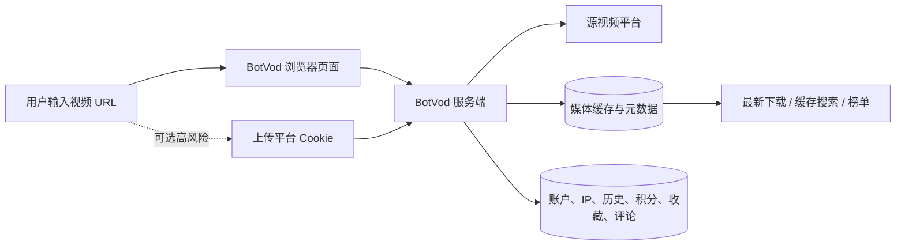

# 证据与风险

## 观察方法

本研究在 2026-08-31 至 2026-09-01 期间执行只读检查：

- 读取首页、缓存页、登录/注册页和站点地图；
- 读取公开 JavaScript 中的请求路径、状态处理和产品文案；
- 读取公开配置、等级、队列、缓存与榜单接口；
- 检查 HTTP 安全头、DNS/RDAP 与常见法律页面；
- 对公开缓存只做来源和文件类型聚合，没有保留标题、用户名、源链接或媒体文件；
- 没有注册、登录、上传 Cookie、提交下载或执行写接口。

## 事实、推断与建议台账

| 结论 | 类型 | 主要证据 | 置信度 | 备注 |
| --- | --- | --- | --- | --- |
| 支持多个主流视频平台 | 公开观察 | 首页、登录页、公共缓存来源 | 高 | 平台变化可能导致单个平台临时失效 |
| 返回完整视频、纯视频和音频格式 | 前端验证 | `renderFormats` 分组逻辑 | 高 | 未对每个平台逐一提交真实任务 |
| 下载在服务端异步执行 | 前端验证 | `/api/download`、progress、queue、file | 高 | 不知道具体后台框架 |
| 存在缓存命中与直接文件交付 | 前端验证 | cache list、cache/file 路径和分支逻辑 | 高 | 缓存淘汰策略未完整公开 |
| 使用后台媒体合并工具 | 架构推断 | `merging` 状态、视频/音频编码参数 | 中高 | 不能确认是否为 FFmpeg |
| 采用通用平台提取器 | 架构推断 | 多平台行为、格式字段和错误形态 | 中 | 不能确认是否为 `yt-dlp` |
| 有持久化数据库 | 架构推断 | 用户、历史、积分、评论、审核数据 | 高 | 不知道数据库产品和拓扑 |
| 最高支持 8K | 官网宣称 | 登录页、等级字段 | 中 | 本研究未端到端验证 |
| Cookie 加密存储 | 官网/前端宣称 | Cookie 控制台文案 | 低到中 | 没有设计、审计或删除证明 |

## 运营与可信度

### 正面信号

- HTTP 自动进入 HTTPS，并启用了 HSTS。
- 响应包含 CSP、`X-Frame-Options: DENY`、`X-Content-Type-Options: nosniff` 和较严格的 Referrer-Policy。
- 登录有验证码，控制台与写操作有身份限制。
- 有举报、审核、上下架、屏蔽词和缓存清理等治理接口。

这些信号说明站点做了基础 Web 安全和运营控制，但不能证明经营主体、服务端代码或下载内容可信。

### 主要不确定性

- 域名于 `2026-07-26T00:21:55Z` 注册，研究时只有约五周历史。[Verisign RDAP](https://rdap.verisign.com/com/v1/domain/BOTVOD.COM)
- 没有公开可核验的公司法定主体、地址或注册信息。
- `/privacy`、`/terms`、`/about`、`/contact`、`/dmca`、`/.well-known/security.txt` 在检查时不存在。
- 站点地图只列首页、缓存、登录和注册页面。[站点地图](https://botvod.com/sitemap.xml)
- 没有公开 SLA、状态页、版本策略、数据处理协议或稳定开发者 API。

结论是“尚无已确认恶意证据，但透明度不足，需要高谨慎”，而不是简单判定安全或诈骗。搜索中出现的 `btvod.com`、`bvod.com` 属于不同域名，不能作为 BotVod 的证据。

## 隐私数据流

用户需要理解两个关键事实：视频链接会离开本机进入第三方服务器；下载结果可能从私人动作转化为公共缓存和榜单内容。即便具体历史页面只对本人可见，公共缓存仍然可能暴露兴趣、来源或未预期传播的内容。

## Cookie 风险

Cookie 不是普通偏好设置。平台登录 Cookie 可以让持有者在一定条件下代表账户发起请求，而 BotVod 的服务端为了使用 Cookie 必须能读取其有效内容。

因此“加密存储”不能消除以下风险：

- 运营方或高权限后台能够使用凭证；
- 服务端、日志、备份或密钥管理失误导致泄露；
- 受限、私密或付费内容被错误缓存；
- 源平台检测异常使用并限制账户；
- 用户无法独立验证删除是否彻底。

建议：不要上传主账号 Cookie。内部系统也不应接收个人浏览器 Cookie；优先官方 API、OAuth 最小权限或隔离的服务账户。

## 版权与平台条款

技术上可以解析不等于法律上可以下载或再利用。

- [YouTube 服务条款](https://www.youtube.com/static?template=terms)限制未经服务明确授权或权利人许可的下载、复制和自动化访问。
- [TikTok 服务条款](https://www.tiktok.com/legal/page/us/terms-of-service/en?region=us)限制未经许可下载、复制和利用平台内容。
- [X 服务条款](https://x.com/en/tos)要求通过其提供的接口和说明使用服务及内容，并限制绕过技术限制和未经许可抓取。

本研究不是法律意见。进入生产前应由业务与法务按地区、内容权利和平台协议确认边界。

## 风险矩阵

| 风险 | 影响 | 可能性判断 | 控制建议 |
| --- | --- | --- | --- |
| Cookie 泄露或滥用 | 高 | 中 | 不上传个人 Cookie；撤销已有会话并检查账户活动 |
| 私密链接进入第三方缓存 | 高 | 中 | 不提交私密链接；内部系统默认私密且可验证删除 |
| 版权或平台条款冲突 | 高 | 中高 | 只处理自有或授权素材；保存权利证据 |
| 服务突然不可用 | 中高 | 中高 | 不作为关键依赖；保留官方或本地替代路径 |
| 缓存文件被淘汰 | 中 | 高 | 不把它当长期档案；文件进入受控资产库 |
| 平台变化导致解析失败 | 中 | 高 | 多适配器、契约测试、版本化和熔断 |
| 公共内容治理不足 | 中高 | 中 | 默认不公开；建立前置策略和举报 SLA |

## 使用护栏

- 只处理自己拥有或已明确获得授权的公开内容。
- 不登录、不上传平台 Cookie、不复用密码。
- 不提交客户资料、未发布内容、内部链接或付费内容。
- 下载后检查文件扩展名和实际媒体类型，不执行未知可执行文件。
- 任何需要稳定性、批量、团队权限或审计的任务都迁移到受控工具。
