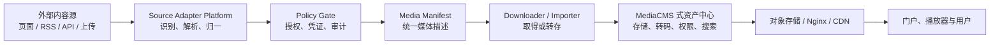
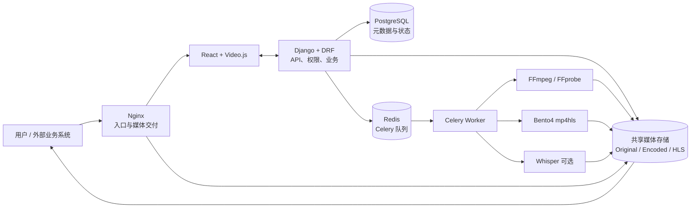
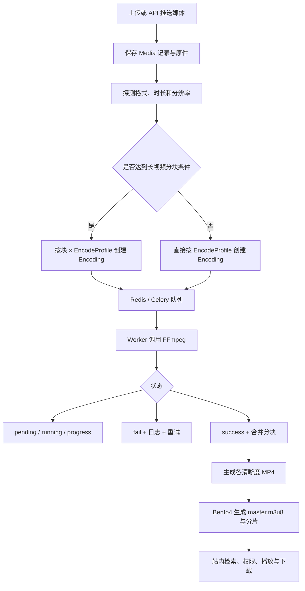

# 媒体平台全景：BotVod、MediaCMS 与我们的适配层

> 一句话：**BotVod 负责把已知 URL 变成可取得的媒体资产，MediaCMS 负责把进入系统的媒体存储、处理、管理并分发；我们的核心是用可插拔 Source Adapter 与统一 Media Manifest 把两端连接起来。**

## 为什么要把两者放在一起看

只研究下载按钮，容易把媒体系统误解为“找到地址后保存文件”。完整链路至少包含来源发现、页面解析、策略校验、文件摄取、资产处理、权限管理、站内检索和播放分发。

- BotVod 是上游“已知 URL 媒体找源与摄取”的黑盒产品样本。
- MediaCMS 是下游“媒体资产管理、处理与分发门户”的开源实现样本。
- 我们真正可持续积累的能力，是二者之间的来源适配、统一模型和治理边界。

## 四类系统不是同一种产品

| 系统 | 输入 | 核心职责 | 输出 | 明确不负责 |
| --- | --- | --- | --- | --- |
| BotVod | 已知视频页面 URL | 平台识别、媒体找源、格式清单、缓存与下载任务 | 可播放或可下载文件 | 完整企业资产治理、全球 CDN |
| 我们的 Source Adapter Platform | 网站、RSS、API、授权连接器 | Adapter 注册、统一 Manifest、策略门、任务编排 | 可治理、可导入的媒体资产 | 不把每个来源的特殊逻辑泄露给下游 |
| MediaCMS | 上传文件或 API 推送媒体 | 存储、转码、HLS、元数据、权限、站内搜索、门户 | 可管理、可播放、可分享的媒体库 | 任意网页搜源、通用站点解析下载 |
| CDN / 对象存储 | MP4、HLS 清单与分片 | 边缘缓存、带宽调度、Range、回源保护 | 大规模稳定传输 | 找源、内容管理、转码策略 |

## MediaCMS 本质是什么

MediaCMS 是一套自托管的媒体资产与分发管理系统，而不是网页源解析器。它从“媒体已经上传或由 API 推入系统”之后开始发挥作用。

### 六段生命周期

1. **接入**：网页上传、分片续传和 REST API 上传。
2. **存储**：保存原件、转码文件、HLS、字幕、封面、缩略图和元数据。
3. **处理**：用 FFmpeg/FFprobe 探测与转码，用 Bento4 生成 HLS，可选 Whisper 转录字幕。
4. **管理**：分类、标签、播放列表、审核、用户、角色、直接授权与分类级 RBAC。
5. **分发**：由 Nginx 交付 MP4/HLS；应用层进行权限判断，规模扩大后可继续接对象存储与 CDN。
6. **展示**：React 门户、Video.js 播放、站内搜索、下载、分享、嵌入、评论和互动。

官方仓库同时支持视频、音频、图片和 PDF，并提供公开、私有、不公开链接等发布方式。它的搜索是检索已经进入本地媒体库的内容，不是从公网发现新的视频页面。

## MediaCMS 的实现职责图

MediaCMS 官方开发文档中的系统架构章节尚未完成，下面是根据仓库代码、Docker Compose 和技术文档整理的职责架构，不冒充官方架构图。

### 转码与 HLS 流程

实现上的关键点不是某一个播放器，而是：

- 每个“媒体 × 配置 × 分块”都有持久化任务状态、进度、日志和失败处理。
- Web/API 与 CPU 密集型转码通过 Celery 队列分离。
- 多 Worker 依赖可共享的媒体文件系统；默认部署更接近单站点或共享卷架构。
- 应用负责权限判断，Nginx 负责实际大文件传输。
- 原件、不同清晰度 MP4 和 HLS 会同时增加存储占用。

## 对我们的产品结论

### 值得直接参考

- 统一 Media Manifest：来源差异在适配层结束，下游只认识一种媒体对象。
- 任务对象化：解析、下载、转码、字幕、缩略图都要有状态、进度、日志与可重试性。
- 原件与衍生资产分离：一个媒体对象可以对应原件、多个 MP4、HLS、字幕和封面。
- 权限判断与大文件传输分离：业务层授权，Nginx/CDN 交付。
- 搜源层与资产层解耦：高变化的站点适配器不应污染稳定的媒体库模型。

### 建议建设顺序

1. 先定义 Media Manifest、来源身份、授权状态和内容指纹。
2. 建立 Adapter 注册协议、能力声明、健康检查和版本管理。
3. 增加策略门、凭证隔离、幂等任务、缓存和生命周期管理。
4. 用 MediaCMS API 或同类资产层验证“文件进入系统后的完整闭环”。
5. 规模增长后再将媒体存储与交付替换为对象存储和 CDN。

这样新增来源只需要增加 Adapter，存储、转码、搜索、权限、播放和展示无需跟随来源重写。

## 采用边界

- MediaCMS 使用 AGPL-3.0。若修改并以网络服务方式提供，需要在正式采用前完成许可证义务评估。
- 它不是任意源下载能力；外部 URL 解析仍需我们自己的适配层或受控工具。
- 默认架构依赖本地/共享文件系统，多地域、对象存储原生化和超大规模转码需要额外工程。
- Nginx 源站分发不等同于全球 CDN，大规模用户访问仍需独立交付基础设施。
- 所有下载与转载能力都必须经过授权、平台条款和审计策略约束。

## 主要来源

- [MediaCMS 官方仓库](https://github.com/mediacms-io/mediacms)
- [MediaCMS Docker Compose](https://github.com/mediacms-io/mediacms/blob/main/docker-compose.yaml)
- [MediaCMS 开发者文档](https://github.com/mediacms-io/mediacms/blob/main/docs/developers_docs.md)
- [MediaCMS 转码文档](https://github.com/mediacms-io/mediacms/blob/main/docs/transcoding.md)
- [MediaCMS 权限文档](https://github.com/mediacms-io/mediacms/blob/main/docs/media_permissions.md)
- [MediaCMS 转码任务实现](https://github.com/mediacms-io/mediacms/blob/main/files/tasks.py)
- [MediaCMS 配置](https://github.com/mediacms-io/mediacms/blob/main/cms/settings.py)
