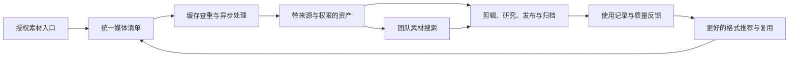
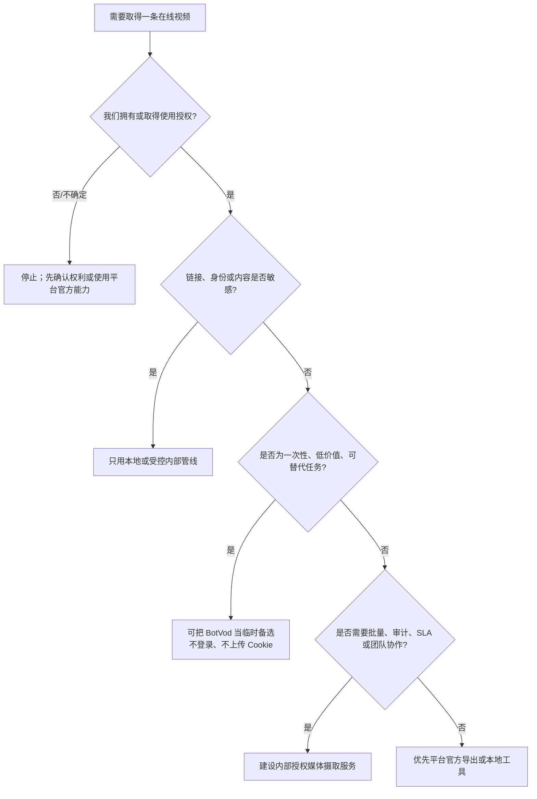
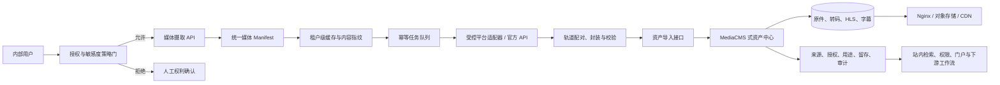

# 对我们的价值

## 总体判断

BotVod 对我们的价值分为两种，结论完全不同：

- **直接作为第三方服务使用：价值低且有条件。** 适合少量、公开、已授权、可替代的临时素材，不应成为生产依赖。
- **作为产品和架构样本研究：价值高。** 它把提取、格式归一化、缓存、异步任务、交付和内容发现连成了一条可观察链路，适合转化为我们自己的受控媒体资产入口。

推荐策略是：**研究其模式，不依赖其凭证和存储；复用职责设计，不复制站点代码或公共缓存内容。**

进一步收敛后，价值不在播放器或下载按钮，而在前置的三项能力：

1. **平台适配与找源**：把不同页面结构、媒体清单和访问上下文收敛成统一入口。
2. **Media Manifest 归一化**：让清晰度、容器、编码、视频轨和音频轨成为下游可理解的数据契约。
3. **资产治理**：在缓存、任务、来源授权、留存与审计之间建立同一条生命周期。

如果我们已经拥有稳定、授权的媒体 URL，那么自建播放器与下载响应的边际价值很低；如果我们缺少“合法且稳定地找到并描述媒体源”的能力，播放器再完整也无法形成生产能力。

## 价值分层

| 价值层 | 价值判断 | 可复用内容 | 不应继承的部分 |
| --- | --- | --- | --- |
| 用户体验 | 高 | 单链接入口、格式按用途分组、缓存命中即时反馈、可解释进度 | 默认把下载结果导向公共内容库 |
| 媒体工程 | 高 | 统一 manifest、格式缓存键、异步 Worker、轨道合并、统一资产交付 | 依赖不透明的第三方 Cookie |
| 产品增长 | 中高 | 下载者同时成为内容供给者，积分、榜单和分享形成循环 | 用公开化换增长而缺少充分告知 |
| 内容运营 | 中 | 搜索、榜单、举报、上下架、缓存治理 | 缺少明确版权与审核 SLA |
| 企业供应商 | 低 | 可作为临时备用工具 | 无主体、合同、SLA、DPA、稳定 API 与状态页 |
| 竞争情报 | 中 | 观察轻量媒体工具如何从功能走向社区 | 公共榜单样本有偏差，不能代表市场全貌 |

## 对我们的三个直接启发

### 1. 把“下载”改写成“授权媒体摄取”

用户真正需要的不是一个匿名文件，而是一个可追溯资产：来源是什么、谁有权使用、下载时选择了哪个轨、能否公开、何时清理、后续在哪些项目使用。我们的产品命名和数据模型都应围绕“摄取与资产登记”，而不是“绕过平台下载”。

### 2. 缓存不是纯技术优化，而是产品能力

缓存命中可以让重复素材瞬时交付，也能驱动团队内的素材复用。但前提是缓存按租户和权限隔离，默认不公开，并能解释来源与生命周期。公共缓存是 BotVod 的增长引擎；私有、可审计缓存更符合我们的价值。

### 3. 队列透明度决定用户是否信任长任务

媒体处理天然是长任务。用户需要知道自己是在排队、拉取、合并、校验还是等待授权。可解释状态比一个不断跳动的百分比更有价值，也能减少重复提交和支持成本。

## 价值飞轮

与 BotVod 不同，我们的飞轮应由“授权资产和团队复用”驱动，而不是由“公共下载榜单”驱动。

## 使用还是重建：决策树

## 建议的内部目标架构

### 与 BotVod 的关键差异

| 设计点 | BotVod 观察 | 我们的建议 |
| --- | --- | --- |
| 默认可见性 | 内容可能进入公共缓存/榜单 | 默认私密，显式授权才共享 |
| 凭证 | 鼓励用户绑定平台 Cookie | 不接收个人 Cookie；使用官方 API 或受控服务账户 |
| 缓存键 | URL + 格式 | 再加入租户、授权范围、内容指纹和版本 |
| 资产记录 | 标题、作者、格式、互动 | 再加入权利人、用途、项目、到期、处理链和审计 |
| 失败恢复 | 重试、取消、进度 | 再加入幂等键、租约、死信、来源级熔断 |
| 治理 | 举报、审核、下架 | 前置策略门 + 后置审计 + 可验证删除 |

### 与 MediaCMS 的关系

MediaCMS 适合验证 `Import` 之后的下游闭环：文件入库、异步转码、HLS、字幕、元数据、站内搜索、权限和门户展示。它不替代 `Adapters`，也不解决任意网页的来源发现与解析。

我们的核心应该保持在资产中心之前：

- Adapter 协议持续扩展来源，但对下游始终输出同一种 `MediaManifest`。
- 策略门在下载前判断授权、凭证、可见性和审计要求。
- MediaCMS 可以作为早期下游实现，也可以只作为任务、资产和权限模型的架构参考。
- CDN 是规模化交付基础设施，不承担搜源、转码决策或内容治理。

完整分层见 [媒体平台全景](media-platform-landscape.md)。

## 分阶段路线

### P0：先建立可信边界

- 只接收已授权的公开链接；在提交前记录权利来源和用途。
- 默认私密，不建立公共榜单。
- 明确数据留存、删除、日志和责任人。
- 禁止上传个人浏览器 Cookie。

### P1：建立最小工程闭环

- 统一 `MediaManifest` 和 `Asset` 数据结构。
- 做 URL 规范化、格式级幂等键、缓存命中与异步任务状态机。
- 先支持 1–2 个最有价值且合规路径清晰的平台。
- 为队列等待、源站下载、封装、校验和交付提供分阶段状态。

### P2：连接内容工作流

- 增加字幕、封面、章节和来源元数据包。
- 将资产接入剪辑、研究资料库、发布审批或 DAM/MAM。
- 加入内容指纹、重复资产合并、授权到期提醒和删除证明。
- 用实际任务成功率、缓存命中率和素材复用率决定是否继续扩大平台覆盖。
- 评估通过 MediaCMS API 接入现成资产门户，或复用其职责模型建设自有下游。

## 成功指标

| 目标 | 指标 |
| --- | --- |
| 减少重复工作 | 缓存命中率、重复素材合并率、平均交付时间 |
| 提升可靠性 | 解析成功率、任务成功率、P50/P95 排队时间、重试后恢复率 |
| 改善素材质量 | 格式误选率、无声视频投诉率、兼容性失败率 |
| 支持团队复用 | 被二次使用的资产占比、来源完整率、授权字段完整率 |
| 控制风险 | 未授权提交拦截率、敏感内容误入率、按期删除率、审计覆盖率 |

## 最终建议

1. 将 BotVod 定位为研究样本和低风险临时备选，不纳入关键生产依赖。
2. 不上传个人 Cookie，不复用密码，不提交私密或未发布链接。
3. 若我们的内容工作流确有需求，优先做“授权策略门 + 统一 Manifest + 私有缓存 + 异步状态机”的最小内部版本。
4. 在任何自动化之前先完成版权、平台条款、数据留存和删除责任的产品化设计。
