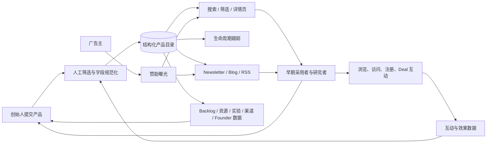

# early.tools

> 一个围绕“更早发现产品”建立的人工策展目录，并向创始人延伸出发布、验证、分发与获客工具。本研究重点是它如何把目录、媒体和会员工具组合成一个多边平台。

## 项目信息

| 字段 | 内容 |
| --- | --- |
| 上游网站 | [https://www.early.tools/](https://www.early.tools/) |
| 研究基线 | 2026-09-01 公网页面快照；首页响应 ETag `"jb4oqzd9nj10cdl"` |
| 上游许可证 | 非开源在线服务；使用受 [Terms of Service](https://www.early.tools/terms) 约束 |
| 研究状态 | `validated` |
| 首次研究 | 2026-09-01 |
| 最近更新 | 2026-09-01 |
| 标签 | `product-discovery, directory, curation, lifecycle, founder-tools, marketplace, growth` |

## 核心结论

early.tools 不是时间管理产品，也不要与 `early.app` 混淆。它更准确的定义是：

> **早期产品情报目录 + 创始人增长工具箱 + 垂直媒体广告位。**

平台同时服务三类参与者：

1. 早期采用者、产品研究者和技术侦察人员，用它发现尚处于 Waitlist、Alpha、Beta 或 Early 阶段的产品。
2. 创始人和独立开发者，用它发布产品、进入 Newsletter、验证需求并寻找外部分发渠道。
3. 面向创业者销售服务的广告主，用它购买站内和 Newsletter 的定向曝光。

它的核心竞争力不只是“收录很多链接”，而是把不同来源的产品线索经过策展、规范化和持续跟踪，再把产品阶段、创始人、优惠、存活状态、内容分发和会员工作流组织在同一个数据模型中。

## 能力是什么

### 1. 早期产品发现

- 在 Early 与 Public 产品之间切换。
- 按 Waitlist、Alpha、Beta、主题、平台、Staff Pick、Featured 和 Deal 等维度筛选。
- 支持搜索以及 Featured、Newest、Oldest、A–Z 等排序。
- 当前首页快照包含 448 个产品，其中 305 个为 Early、143 个为 Public。
- 当前样本明显偏向 AI、Web、开发者工具和独立创业生态：125 个条目属于 AI & Agents，300 个条目支持 Web。

### 2. 产品详情与轻量情报

每个产品详情页可以组合展示：

- 简介、扩展说明、官网和访问入口；
- 创始人的 X、LinkedIn、个人网站和公司网站；
- 产品阶段、开放注册或邀请状态、主题和平台；
- Deal、折扣、候补名单跳过方式或联系创始人的入口；
- Lifeline，包括上线时间、开始跟踪时间、阶段事件和当前存活状态；
- 页面浏览、外链访问等互动指标；
- 相似产品和同阶段产品推荐。

这里的 `tracking` 指产品生命周期与网站状态，不是个人工时记录。详情页样例见 [anyfeeds](https://www.early.tools/anyfeeds)。

### 3. 持续策展与内容分发

- 人工筛选提交内容，而不是完全开放、自动收录。
- 通过产品详情页、阶段页、Blog、Glossary 和 Newsletter 形成长期可索引内容。
- 通过周报持续发布新产品和阶段变化，而不是只在“发布当天”制造一次曝光。
- 页面元数据暴露 Blog RSS 与新工具 RSS，适合订阅式消费。

### 4. 创始人会员工具箱

会员区把目录延伸成创业操作工具：

- [Early Backlog](https://www.early.tools/backlog)：提前查看尚未正式公开的产品管线。
- [Founders](https://www.early.tools/founders)：当前约 489 位创始人，包含社交账号、邮箱、产品和发布记录，并支持筛选与 CSV 导出。
- [Startup Resources](https://www.early.tools/resources)：当前约 1,159 条工具、文章、模板和指南，按 Idea、Concept、MVP、Business、Scale 等阶段组织。
- [Validation Experiments](https://www.early.tools/experiments)：当前约 54 种验证方法，可按定性/定量、验证目标、测试阶段、速度、可靠性和成本筛选。
- [Directories](https://www.early.tools/submit-to)：当前约 151 个发布渠道，可按渠道类型、价格与提交难度筛选和追踪。

### 5. 发布、推广与变现

- 创始人使用邮箱 Magic Link 登录并提交产品。
- 免费提交会进入人工策展流程，但不保证进入首页。
- 近期官方 Newsletter 展示单次快速 Listing、Membership 和 Sponsor 三类付费方案。
- Sponsor 覆盖站内页面与 Newsletter，并展示自报的曝光、点击和订阅数据。
- 近期 Newsletter 使用美元标价，而 Sponsor 页面使用欧元标价；实际购买应以结账页为准。

## 信息从哪里来

这是理解 early.tools 最关键的一层：它不是一个单一来源数据库，而是把多类输入加工成统一的产品情报。

| 来源 | 能确认什么 | 仍然不知道什么 |
| --- | --- | --- |
| 创始人主动提交 | 官方隐私政策确认用户会提交用于公开的文字、图片或视频，提交内容关联账号或邮箱并经过审核 | 每个公开产品是否由创始人本人提交 |
| 运营者主动发现与人工策展 | 首页明确说明平台每日由人工策展 | 具体监控哪些社区、Newsletter、发布站或社交网络，以及各来源占比 |
| 产品官网与公开社交资料 | 详情页展示产品官网、Founder X、LinkedIn、个人网站和公司网站 | 这些字段是提交、手工补充还是自动抓取 |
| 平台持续观测 | Lifeline 展示 Went Online、Tracking Since、Alive、阶段事件和互动数字 | 检查频率、自动化比例和阶段变更规则 |
| 用户与交易行为 | 隐私政策确认会采集访问日志、页面活动、账号、订阅、交易和分析数据 | 哪些事件具体进入公开 Engagement 或 Sponsor 指标 |

因此，它的处理链更接近：

```text
创始人提交 / 人工发现 / 公开资料 / 平台观测 / 用户行为
                         ↓
              审核 → 去重 → 字段规范化
                         ↓
              生命周期跟踪与互动统计
                         ↓
           目录 / 推荐 / Newsletter / 会员工具
```

对我们的可复用意义不是简单模仿收集渠道，而是给重要字段保留三类元数据：

1. **来源**：原始 URL、提交者或观测方式。
2. **时间**：首次采集时间与最后验证时间。
3. **置信度**：已确认、合理推断或未知。

early.tools 当前公开页面没有提供逐字段来源、采集频率、审核记录或来源占比，所以它适合发现线索，不适合直接替代尽调。官方条款也不保证材料完整、准确或可靠。来源边界与一手证据见[证据与推断边界](notes/evidence.md)。

## 原理是什么

### 产品原理：多边平台加策展飞轮



飞轮的关键是：更多创始人提交带来更多独家早期信息；更多早期信息吸引高意向用户；用户互动和 Newsletter 受众又提高创始人的提交、付费 Listing 与 Sponsor 意愿。

### 技术原理：SEO 优先的结构化目录

公开证据能够确认：

- 网站使用 Next.js，部署在 Vercel；首页为预渲染页面并经过 Vercel Cache。
- 产品数据以结构化字段进入页面，包括 slug、主题、平台、阶段、子阶段、Deal、创始人链接、上线与毕业时间等。
- 产品 Logo 大量存放在 Vercel Blob。
- 未登录用户可以浏览公共目录，但会员数据通过登录态与 Paywall 控制。
- 页面展示互动数字和 Sponsor 效果指标，说明系统记录至少一部分页面访问与外链点击事件。

基于页面行为可以合理推断，但无法从黑盒网页完全确认：

- 后台存在提交审核与内容编辑界面；
- 存在用于网站存活检测、阶段更新或 Newsletter 发布的定时任务；
- 存在关系型或文档型数据库保存产品、创始人、阶段事件、Deal、资源与互动事件；
- 存在推荐、排序和 Sponsor 轮播逻辑；
- 支付、邮件和分析服务的具体供应商仍需后台代码或官方架构说明才能确认。

更详细的分层、数据模型与边界见 [技术与产品原理](notes/architecture.md)。

## 使用场景是什么

| 使用者 | 核心任务 | 典型使用方式 | 不应依赖它完成的事情 |
| --- | --- | --- | --- |
| 早期采用者 | 比大众更早发现新产品 | 浏览阶段页、加入 Waitlist、领取 Deal | 判断产品一定可靠或长期存活 |
| 独立开发者/创始人 | 获得第一批曝光 | 提交产品、购买快速 Listing、进入 Newsletter | 替代完整营销与销售体系 |
| 产品经理/创新团队 | 扫描技术与市场趋势 | 按主题和平台建立候选清单，观察阶段变化 | 企业级供应商尽调 |
| 投资人/分析师 | 获取早期项目线索 | 从 Backlog、Founder 和 Lifeline 发现候选项目 | 核实融资、收入、客户或合规状态 |
| 创业服务商/招聘方 | 寻找高意向 Founder Leads | 搜索 Founder Directory，筛选可联系对象 | 未经同意的大规模营销骚扰 |
| 创始人运营团队 | 验证和分发产品 | 使用实验库、资源库和目录提交追踪器 | 取代项目管理、CRM 或用户研究工具 |
| 广告主 | 触达创业者与早期用户 | 购买站内及 Newsletter Sponsor | 获得未经独立审计的投放效果保证 |

具体工作流与适用边界见 [使用场景](notes/use-cases.md)。

## 可扩展方向是什么

建议按以下顺序扩展：

1. **P0：可信度与新鲜度。** 增加来源标注、更新时间、失效检测、Deal 验证、创始人认证和数据置信度。
2. **P1：个性化情报。** 增加收藏、清单、阶段变化提醒、主题订阅、推荐图谱和自然语言搜索。
3. **P1：创始人增长闭环。** 把目录提交追踪升级为发布计划、UTM、来源归因、Waitlist 转化和 Newsletter 效果面板。
4. **P2：数据 API 与 Agent 接口。** 提供公开 API、Webhook、MCP Server、Slack/Discord/Raycast 集成，让团队和 AI Agent 消费产品变化。
5. **P2：市场地图与趋势分析。** 自动聚类相似产品、识别拥挤赛道、生成竞品图谱和周/月趋势报告。
6. **P3：国际化与区域生态。** 增加中文等语言、区域发布目录、当地 Deal、货币与隐私规则。
7. **P3：受控社区层。** 增加经过验证的体验报告、问答与 Founder 更新，但避免演变成低质量投票和刷榜平台。

完整优先级、目标指标、技术支撑与风险见 [扩展路线](notes/roadmap.md)。

## 优点与局限

### 优点

- 聚焦发布前和早期阶段，定位比通用软件目录更清晰。
- 持续跟踪生命周期，而不是一次性的发布页。
- 产品、创始人、Deal、内容与分发工具形成完整的信息链。
- SEO 页面、Newsletter 和 Sponsor 共同构成可持续的内容与商业模式。
- 会员资源能提高创始人的留存，而不仅靠一次 Listing 收费。

### 局限

- 人工策展不等于独立验证；官方条款也不保证内容完整、准确或外链可靠。
- 当前样本明显偏 AI、Web 和英文独立创业生态。
- 多数高价值 Founder 数据、资源和工具位于会员墙后。
- Featured、Sponsor 与编辑推荐共存，商业曝光会影响可见性。
- 缺少完整的融资、收入、客户、合规、安全审计和结构化用户评价数据。
- Sponsor 指标来自平台自报，且“平均到最佳”口径不等同于可预测的投放结果。

## 可复用结论

- 垂直目录要有生命力，必须记录“变化”，而不只是保存静态链接。
- 人工策展的价值来自明确的选择标准、字段规范和持续更新，而不是“人工”这个标签本身。
- 目录业务可以通过数据、工作流与媒体分发提高客单价，避免只依赖一次性 Listing。
- 对外展示事实与内部推断必须分开；发现平台尤其需要来源、更新时间和置信度。
- 最有价值的扩展不是无限增加条目，而是先让来源、验证时间和置信度可追溯，再提高个性化和从发现到转化的闭环能力。

## Demo

已提供一个原创、纯静态的[中文能力地图 Web Demo](../../apps/early-tools-capability-lab/)。它先解释五类信息来源、确认程度和处理链，再用角色切换、七类能力库、公开数据构成、策展飞轮、使用边界和 P0–P3 路线解释 early.tools；不复制第三方页面、素材或会员内容。

在线访问：[early.tools 中文能力地图](https://yydshly.github.io/0831_codex_project/demos/early-tools-capability-lab/)

Demo 已在 1440×1000、768×900、390×844 视口以及 light/dark 主题中完成真实浏览器验证。构建、交互、键盘、无障碍与截图证据见 [Web Demo 验证记录](notes/web-demo-validation.md)。

## 研究文档

- [技术与产品原理](notes/architecture.md)
- [使用场景](notes/use-cases.md)
- [扩展路线](notes/roadmap.md)
- [证据与推断边界](notes/evidence.md)
- [Web Demo 设计契约](notes/web-demo-contract.md)
- [Web Demo 验证记录](notes/web-demo-validation.md)

## 来源与相关链接

- [首页](https://www.early.tools/)
- [产品详情页样例](https://www.early.tools/anyfeeds)
- [Early Backlog](https://www.early.tools/backlog)
- [Founder Directory](https://www.early.tools/founders)
- [Startup Resources](https://www.early.tools/resources)
- [Validation Experiments](https://www.early.tools/experiments)
- [Directories](https://www.early.tools/submit-to)
- [Newsletter 069 与近期方案](https://www.early.tools/newsletter/69)
- [Sponsor 页面](https://www.early.tools/sponsor)
- [Privacy Policy](https://www.early.tools/privacy)
- [Terms of Service](https://www.early.tools/terms)

## 变更记录

- `2026-09-01`：创建研究条目，完成能力、原理、场景与扩展方向的第一版黑盒分析。
- `2026-09-01`：增加中文能力地图 Web Demo，并完成多视口、主题、交互与无障碍验证。
- `2026-09-01`：将信息来源、来源处理链与可追溯原则提升为研究和 Web Demo 的核心章节。
