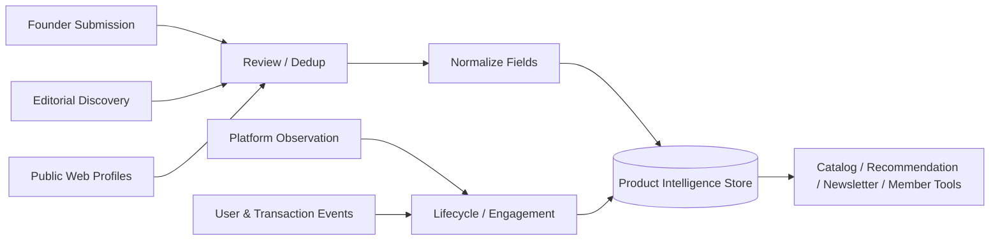
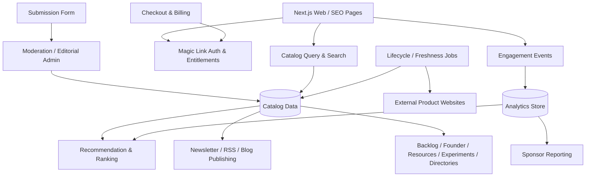

# 技术与产品原理

## 分析口径

本文只使用公开网页、HTTP 响应、页面序列化数据和可见交互进行黑盒分析。没有取得 early.tools 的服务端源码、后台管理界面或数据库，因此所有结论分为：

- **已确认**：可以从公开页面、响应头或官方文案直接观察。
- **推断**：根据产品行为和数据结构作出的合理架构判断，不能视为官方实现说明。

## 一、产品机制

### 1. 供给侧：创始人提交与人工策展

已确认：

- `/submit` 要求用户通过邮箱 Magic Link 登录。
- 官方 Newsletter 说明平台会从不断增长的 Backlog 中人工挑选产品。
- 免费提交不保证首页曝光，付费 Listing 提供更快的上线承诺。

合理推断：

1. 创始人提交产品名称、URL、简介、Logo、平台、阶段、创始人信息和 Deal。
2. 编辑或管理员检查有效性、质量与分类，并规范字段。
3. 合格条目进入 Early 或 Public 目录；尚未公开的条目进入 Backlog。
4. 后续阶段变化被追加为 stage event，而不是覆盖所有历史。

人工策展解决的是开放目录常见的垃圾条目、重复条目和描述质量问题，但也带来审核吞吐、主观偏差和付费曝光影响。

### 1.1 数据来源与来源链

公开证据支持把输入分成五类：

| 输入层 | 可观察依据 | 在系统中的可能作用 | 边界 |
| --- | --- | --- | --- |
| Founder Submission | Submit、用户生成内容条款和审核说明 | 提供产品、Founder、Logo、阶段、Deal 等原始字段 | 无法判断每条产品是否本人提交 |
| Editorial Discovery | 首页的 daily human curation 文案 | 补充未主动提交的候选项目，形成编辑选择 | 发现渠道、来源占比和选择标准未公开 |
| Public Web Profiles | 产品详情中的官网、X、LinkedIn 与个人网站 | 补充身份、关系和外链字段 | 人工补充、提交或抓取方式未公开 |
| Platform Observation | Lifeline、Alive、阶段事件与 Engagement | 生成状态、时间和互动变化 | 自动检测比例、频率和判断阈值未知 |
| User / Transaction Events | Privacy 中的日志、账号、订阅、交易和分析说明 | 支持互动指标、运营、会员与商业归因 | 逐事件公开口径和 Sponsor 指标映射未知 |



一个更成熟的实现应为核心字段保留 `sourceType`、`sourceUrl`、`submittedBy`、`capturedAt`、`lastVerifiedAt`、`verificationMethod` 和 `confidence`。early.tools 的公共页面目前没有暴露完整的字段级 lineage，因此上述字段属于我们的扩展设计，不是对其后台实现的确认。

### 2. 需求侧：结构化发现

目录不是简单的 URL 列表。它为产品建立了可筛选的结构：

| 维度 | 公开页面中的表现 |
| --- | --- |
| 生命周期 | `EARLY`、`PUBLIC`，以及 `WAITLIST`、`ALPHA`、`BETA` 等子标签 |
| 主题 | AI & Agents、Productivity、Design & Creative、Developer Tools 等 |
| 平台 | Web、macOS、iOS、API & CLI、Hardware、Chrome Extension、Figma 等 |
| 编辑标签 | Staff Pick、Featured |
| 转化状态 | Open signup、Invite、Deal、联系创始人等 |
| 时间 | curated、listed、online、graduated 和 stage event 时间 |
| 关系 | Founder、Company、Similar tools、同阶段工具 |
| 互动 | 详情页浏览、外链访问与 Sponsor 效果指标 |

这些字段支持三个结果：搜索筛选、SEO 落地页和推荐关系。

### 3. 生命周期差异化

普通软件目录通常只回答“这个产品是什么”。early.tools 还尝试回答：

- 它现在处于什么阶段？
- 它从什么时候开始在线？
- 平台从什么时候开始跟踪？
- 它是否已经公开发布或毕业？
- 它今天是否仍然可访问？

Lifeline 把一次性 Listing 变成时间序列。只要阶段数据持续更新，目录就能生产状态提醒、趋势分析和 Newsletter 内容。

### 4. 内容与商业分发

相同的结构化数据被复用为多种表面：

- 首页与阶段页；
- 产品详情页和相似推荐；
- Founder Profile；
- Blog、Glossary 与 Newsletter；
- Sponsor 横幅与 Newsletter 广告；
- 会员 Backlog、资源、实验和目录工具。

这种“一份结构化数据，多种分发形式”的方式能提高每个条目的长期价值。

## 二、公开可见的技术架构

### 1. Web 层

已确认：

- HTTP 响应包含 `X-Powered-By: Next.js`、`Server: Vercel` 和 `X-Nextjs-Prerender: 1`。
- 首页响应包含 `X-Vercel-Cache: HIT`，说明预渲染内容经过边缘缓存。
- 页面使用 React Server Components/Next Router 相关响应字段。
- 产品页面生成 title、description、Open Graph、Twitter Card 和结构化 SEO 数据。

推断的目标是：让大量产品、阶段、主题和内容页可以被搜索引擎索引，同时保留筛选、排序、登录和 Paywall 等客户端交互。

### 2. 媒体与静态资源

已确认：

- 大量产品 Logo 来自 `public.blob.vercel-storage.com`。
- 图片通过 Next.js Image 路径进行尺寸与质量处理。
- 首页引入 `analytics.neuklick.com` 的分析脚本。

未确认：

- Logo 上传是否全部使用 Vercel Blob，还是混合保留外部来源。
- 分析脚本是否承担全部浏览/点击统计，或只是站点级分析。

### 3. 身份与权限

已确认：

- Submit 与 Account 路由会引导至邮箱 Magic Link 登录。
- Founder、Resources、Experiments 和 Directories 页面会向未授权用户展示模糊内容与 `Upgrade to unlock`。
- Founder Directory 的导出能力是会员权限。

推断的权限层级至少包括：匿名访客、已登录普通用户、会员和管理员/编辑。

### 4. 数据与事件

从页面序列化字段可以确认或高置信推断以下核心实体：

```text
Tool
├─ identity: id, slug, name, description, logo
├─ taxonomy: topic, platforms, stage, subLabel
├─ editorial: staffPick, featured, scheduledListAt, listedAt
├─ lifecycle: onlineSince, graduatedAt, stageEvents
├─ relations: founder, company, similarTools
└─ conversion: website, signupMode, deal

Founder
├─ identity / name
├─ X / LinkedIn / email / website
├─ tools and launch history
└─ engagement and latest launch

Deal
├─ kind / headline / value
├─ redeemUrl / instructions / expiresAt
└─ revealCount

EngagementEvent（推断）
├─ page_view
├─ outbound_visit
├─ deal_reveal
└─ sponsor_impression / sponsor_click
```

会员侧还需要 Resource、Experiment、Directory 和 Submission 等实体。

## 三、推断的服务分层



这不是官方架构图，而是满足当前公开能力所需的最小逻辑分层。

## 四、关键飞轮

### 发现飞轮

```text
更多提交 → 更多早期产品 → 更多搜索与订阅用户
→ 更多点击和注册 → 对创始人更有吸引力 → 更多提交
```

### 内容飞轮

```text
结构化产品变化 → 阶段页 / Newsletter / Blog / RSS
→ 搜索与订阅流量 → 更多互动数据 → 更好的选题与推荐
```

### 收入飞轮

```text
高意向创业者受众 → Listing / Membership / Sponsor 收入
→ 支持策展和工具建设 → 数据更完整 → 受众意向更高
```

会员资源的重要性在于增加复购与留存：创始人即使完成一次发布，仍然会因为 Backlog、Founder、验证实验和分发追踪继续使用平台。

## 五、架构优势与技术风险

### 优势

- SEO 友好的预渲染页面适合长尾目录。
- 结构化生命周期字段为提醒、趋势和推荐留下空间。
- 同一数据源复用于公共目录、会员工具和媒体内容。
- Vercel 缓存与 Blob 适合当前规模的快速迭代。

### 风险

- 首页预渲染数据量很大；当前 HTML 接近 1.6 MB，条目继续增长会影响首包、爬虫成本和缓存更新。
- 公开页面序列化大量产品记录，会员资源如果只在前端模糊而未在服务端裁剪，可能产生数据泄露风险；应确保授权发生在数据查询层。
- 网站存活不等于产品可信，自动健康检测必须与人工验证分开。
- 点击和 Sponsor 指标需要去重、防刷和统一归因口径。
- Founder 邮箱与社交数据需要处理同意、删除、导出和反骚扰要求。

## 六、尚未确认的问题

- 数据库、全文搜索引擎和队列/定时任务的具体实现。
- Magic Link、支付、Newsletter 和分析服务的具体供应商。
- 产品阶段是自动发现、创始人更新还是编辑手动维护。
- `Alive` 的检测频率、超时、重定向和错误判断规则。
- Featured 排序与相似推荐是否由规则、编辑或模型驱动。
- 浏览、外链点击和 Sponsor 指标的去重窗口与机器人过滤方式。

在得到源码或官方架构说明之前，这些问题必须保持为待验证项。
