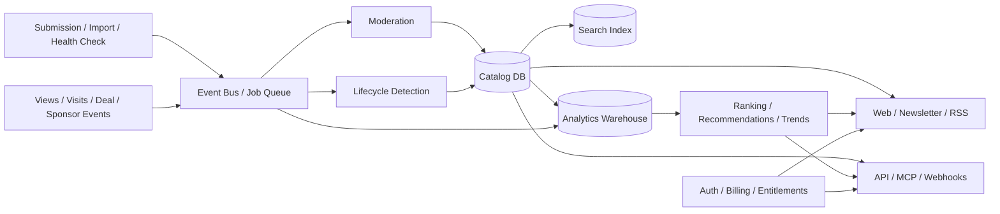

# 扩展路线

## 扩展原则

early.tools 的扩展不应简单追求“更多条目”。合理顺序是：

1. 先让数据更可信、更及时；
2. 再让用户更容易得到个性化信号；
3. 然后连接创始人的验证、发布和转化闭环；
4. 最后把高质量数据开放给团队、开发者和 AI Agent。

## P0：可信度与数据新鲜度

### 能力

- 为描述、阶段、Deal、创始人身份和存活状态显示来源与最后验证时间。
- 增加 Founder Verified、Domain Verified 和 Deal Verified。
- 为产品生成 Freshness Score 与 Confidence Score。
- 自动检测域名不可达、重定向、停服、Waitlist 关闭和重大页面变化。
- 提供纠错、认领、合并重复条目和下架流程。
- 对 Sponsor、Featured、Staff Pick 使用更清晰的视觉与规则披露。

### 原因

发现目录的长期壁垒不是条目数量，而是可信的变化历史。没有来源和新鲜度，生命周期数据会逐渐失去价值。

### 指标

- 30/60/90 天内已验证条目占比；
- 失效链接检测准确率；
- 纠错平均处理时间；
- 被创始人认领的条目占比；
- Deal 兑换失败率。

## P1：个性化产品情报

### 能力

- 收藏、列表和团队共享清单；
- 按主题、平台、阶段和 Founder 订阅变化；
- 邮件、Web Push、Slack、Discord 或 Telegram 提醒；
- 自然语言搜索，例如“最近三个月进入 Beta 的本地优先 macOS AI 工具”；
- 基于主题、技术栈、受众和创始人关系的推荐图谱；
- 个人化 Digest，替代所有人相同的 Newsletter。

### 技术支撑

- 独立搜索索引，如 Typesense、Meilisearch 或 Elasticsearch；
- 事件化的生命周期历史；
- 用户兴趣与收藏模型；
- 通知偏好、去重和节流服务。

### 指标

- 收藏后回访率；
- 订阅提醒点击率；
- 搜索无结果率；
- 推荐点击与外链访问转化。

## P1：Founder Growth OS

### 能力

- 发布日历和 Launch Checklist；
- 目录提交状态、联系人、结果和下次跟进；
- 为每个目录自动生成适配后的标题、描述、截图清单和 UTM；
- Waitlist 注册、Deal 领取和官网访问的归因面板；
- 多次发布、版本更新和 Changelog；
- Newsletter、Sponsor 和 Listing 的统一效果报告；
- 与 Linear、Notion、Airtable、HubSpot 和邮件工具同步。

### 风险控制

- 不应自动向大量目录或 Founder 发送垃圾内容；
- 自动提交必须遵守各目录条款与速率限制；
- 归因必须区分曝光、点击、注册、激活和付费。

### 指标

- 每个发布项目完成的目录数；
- 从外链访问到 Waitlist/注册的转化；
- Founder 会员留存；
- Listing 的重复购买率。

## P2：趋势与竞争情报

### 能力

- 按周/月展示新增产品、阶段迁移和死亡率；
- 生成赛道地图、相似产品集群和拥挤度；
- 标记快速增长的主题、平台和交互模式；
- 比较产品定位、Deal、平台覆盖和发布时间；
- 允许用户导出带来源的市场研究报告。

### 原理

现有目录已经拥有分类和时间字段。只要历史数据完整，就可以从“产品查询”自然升级为“变化分析”。

### 指标

- 趋势报告订阅与引用；
- 竞品清单创建量；
- 数据导出和团队分享率。

## P2：API、Webhook 与 Agent 接口

### 能力

- 只读 Catalog API；
- 产品新增、阶段变化、Deal 更新和网站失效 Webhook；
- MCP Server，让 AI Agent 搜索产品、比较赛道和创建 Watchlist；
- Slack/Discord Bot 与 Raycast Extension；
- 经过授权的 Founder 与会员数据接口；
- 数据使用配额、字段级权限和审计日志。

### 商业模式

- 免费低速公开 API；
- Pro/Team 高配额；
- 商业数据授权；
- 嵌入式推荐或白标目录。

### 风险

- Founder 联系信息不能默认进入公开 API；
- 需要防止批量抓取、垃圾外联和数据再售；
- 输出必须带来源、时间与置信度。

## P3：受控社区层

### 可取方向

- Verified User Note：简短、结构化、可追溯的体验报告；
- Founder Update：里程碑、版本和阶段更新；
- Ask the Founder：围绕产品事实的问答；
- Expert Collection：由可信策展人维护的主题清单。

### 不建议方向

- 直接复制 Product Hunt 式单日投票榜；
- 没有身份和使用证据的五星评分；
- 以连续签到、互赞换票驱动的社区增长。

社区层应提高信号质量，而不是制造新的刷榜问题。

## P3：国际化与区域生态

### 能力

- 中文、日文、西班牙文等界面与内容；
- 区域产品、当地 Founder 和本地发布渠道；
- 多币种结账和统一价格显示；
- 不同地区的隐私、营销同意和数据删除流程；
- 区域 Newsletter 与策展合作伙伴。

### 机会

目前站点高度偏英文和西方独立创业生态。本地化不是简单翻译，而是补充不同地区的产品供给、渠道和 Founder 网络。

## 建议的目标架构

建议把 Catalog、Lifecycle、Engagement、Entitlement 和 Publishing 分成清晰领域，避免所有业务继续堆在单一页面查询和前端组件中。

## 12 个月优先级建议

| 时间 | 重点 | 可交付结果 |
| --- | --- | --- |
| 0–3 个月 | 可信度与性能 | Freshness/Source、失效检测、会员数据服务端裁剪、首页分页或流式加载 |
| 3–6 个月 | 个性化 | 收藏、Watchlist、阶段提醒、搜索索引、个人 Digest |
| 6–9 个月 | Founder 闭环 | 发布计划、目录追踪升级、UTM 与转化归因、团队协作 |
| 9–12 个月 | 数据产品 | API、Webhook、MCP、趋势报告、受控商业授权 |

## 应避免的战略漂移

- 不要过早做成完整 CRM、项目管理或社交网络。
- 不要用 AI 自动生成大量低质量条目稀释策展价值。
- 不要把付费曝光伪装成自然推荐。
- 不要在缺少来源和同意的情况下销售 Founder 联系数据。
- 不要只优化页面数量和 SEO 流量，而忽略产品状态的真实性。
