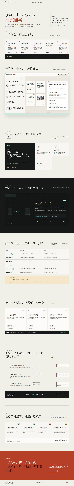

# Write Then Publish（写了就发）能力研究

> 它不是一个供业务代码调用的 npm 库，而是一款把同一份 Markdown/普通文本加工成图文卡片、公众号长文、图片包与 Live Photo 交付物的浏览器内容工作台。

## 项目信息

| 字段 | 内容 |
| --- | --- |
| 上游仓库 | [fxyadela/write-then-publish](https://github.com/fxyadela/write-then-publish) |
| 研究基线 | [`7a708312247e69155ca586c49c65c5306fd88e9e`](https://github.com/fxyadela/write-then-publish/tree/7a708312247e69155ca586c49c65c5306fd88e9e)，2026-08-31 |
| 产品形态 | `private: true` 的原生 HTML/CSS/JavaScript Web 应用；不是已发布的软件包或 SDK（[package.json](https://github.com/fxyadela/write-then-publish/blob/7a708312247e69155ca586c49c65c5306fd88e9e/package.json#L1-L10)） |
| 上游许可证 | [Write Then Publish Personal Non-Commercial License 1.0](https://github.com/fxyadela/write-then-publish/blob/7a708312247e69155ca586c49c65c5306fd88e9e/LICENSE#L1-L17) |
| 研究状态 | `source-reviewed`；基础本地启动已验证，平台发布与真实 Live Photo 交付未在本研究环境中验证 |
| 首次研究 | `2026-08-31`（Asia/Shanghai） |
| 标签 | `content-publishing`、`markdown`、`canvas`、`live-photo`、`obsidian`、`supabase` |

## 证据如何阅读

本文使用四种结论标记：

- **[已验证]**：在固定提交的本地检出上实际执行过，或由本研究 Demo 的自动化检查支持；验证范围会明确写出。
- **[源码审查]**：可由固定提交中的实现直接确认，但本研究没有替上游完成真实平台、真机或生产环境验收。
- **[研究判断]**：综合已验证与源码事实形成的定位、适用性或成熟度判断，不是上游自述。
- **[建议]**：面向复用、改造或产品化的方向，不代表上游已经具备或承诺实现。

上游 README 中的截图、性能数字和平台交付描述只作为“上游声明”理解；除非另有 **[已验证]** 标记，本文不把它们升级为独立实测结论。

## 先给结论

**[研究判断]** `write-then-publish` 的核心价值不是“再做一个 Markdown 编辑器”，而是把内容发布的最后一公里压缩进一个工作区：正文保持一份，图文卡片和公众号长文使用不同渲染路径，图片、Live Photo 与 Obsidian 素材仍围绕同一项目状态组织。**[源码审查]** 上游也把“一份事实源、多个输出”写成产品原则（[PRODUCT.md](https://github.com/fxyadela/write-then-publish/blob/7a708312247e69155ca586c49c65c5306fd88e9e/PRODUCT.md#L26-L32)）。

**[研究判断]** 它最适合个人中文内容创作者，尤其是已经在 Markdown 或 Obsidian 中写作、需要把一篇内容复用到小红书式卡片和公众号长文的人。它不等同于多平台发布中台：当前实现生成发布素材、复制富文本或创建公众号草稿，但没有小红书直发、定时排期、审批、数据分析等能力。

## 它解决什么问题

传统流程常常是：

```text
写正文
  → 到卡片工具重新分段、裁图、分页
  → 到公众号编辑器再次排版
  → 逐张导出、打包、传手机
  → 内容修改后重复上述工作
```

**[源码审查]** 该项目把流程改为：

```text
Markdown / 普通文本 / Obsidian 图片引用
                         │
                         ▼
                  同一份项目状态
                         │
             ┌───────────┴───────────┐
             ▼                       ▼
       Canvas 图文卡片          HTML 公众号长文
             │                       │
      PNG / ZIP / Live Photo    富文本 / 长图 / 草稿
```

“切换模式”修改的是输出形态，而不是生成第二份正文；这使内容修订、视觉检查和多格式复用可以在同一个编辑上下文中完成。

## 能力与边界

| 能力面 | 固定提交中已经实现的机制 | 重要边界 | 证据性质 |
| --- | --- | --- | --- |
| 内容编辑 | Markdown/普通文本输入；标题、加粗、斜体、引用、自定义文字色/背景色/下划线；查找替换、撤销重做 | 是自研的 Markdown 子集，不是 CommonMark/GFM 完整实现 | **[源码审查]**（[块与行内解析](https://github.com/fxyadela/write-then-publish/blob/7a708312247e69155ca586c49c65c5306fd88e9e/src/app.js#L6190-L6530)） |
| 图文卡片 | 按实际字体测量换行，按页面剩余高度分页；支持头像、图片、双图拼图和表格；绘制为 `1728 × 2304` Canvas | 固定竖版画布；超高表格/图片、复杂 Markdown 与字体差异仍需专项测试 | **[源码审查]**（[画布尺寸](https://github.com/fxyadela/write-then-publish/blob/7a708312247e69155ca586c49c65c5306fd88e9e/src/app.js#L1-L17)、[分页](https://github.com/fxyadela/write-then-publish/blob/7a708312247e69155ca586c49c65c5306fd88e9e/src/app.js#L6849-L7036)） |
| 公众号长文 | 同一正文转成主题化 HTML；支持标题、无序列表、引用、代码块、表格和图片；复制带内联样式的富文本或导出长图 | 有序/嵌套列表、链接、脚注、公式、Mermaid 等不是完整语义；微信编辑器兼容性未在本研究中实测 | **[源码审查]**（[长文转换](https://github.com/fxyadela/write-then-publish/blob/7a708312247e69155ca586c49c65c5306fd88e9e/src/app.js#L7349-L7504)、[富文本序列化](https://github.com/fxyadela/write-then-publish/blob/7a708312247e69155ca586c49c65c5306fd88e9e/src/app.js#L7658-L7763)） |
| 图片处理 | 上传、粘贴、拖放、批量导入；按源图坐标裁剪；调整宽度、固定尺寸、左右/居中对齐；两图拼接 | 不是自由画布或完整图片编辑器；没有蒙版、滤镜、图层系统和素材资产库 | **[源码审查]**（[导入](https://github.com/fxyadela/write-then-publish/blob/7a708312247e69155ca586c49c65c5306fd88e9e/src/app.js#L4920-L4968)、[裁剪](https://github.com/fxyadela/write-then-publish/blob/7a708312247e69155ca586c49c65c5306fd88e9e/src/app.js#L5737-L5865)） |
| 普通导出 | 单张 PNG、批量 PNG ZIP、公众号 PNG 长图；浏览器支持时使用文件选择器保存，否则触发下载 | 网络图片可能污染 Canvas；长图受浏览器 Canvas/内存上限影响 | **[源码审查]**（[保存与长图](https://github.com/fxyadela/write-then-publish/blob/7a708312247e69155ca586c49c65c5306fd88e9e/src/app.js#L10979-L11157)、[批量 ZIP](https://github.com/fxyadela/write-then-publish/blob/7a708312247e69155ca586c49c65c5306fd88e9e/src/app.js#L11212-L11291)） |
| Live Photo | 选择 3/5 秒片段、裁剪、保留声音；优先在支持 WebCodecs 的浏览器中解码、叠入卡片、重编码 H.264、写 Apple 配对标记并打包 | 真机识别和目标平台是否保留动态效果未由本研究验证；浏览器兼容与大视频资源压力明显 | **[源码审查]**（[浏览器引擎](https://github.com/fxyadela/write-then-publish/blob/7a708312247e69155ca586c49c65c5306fd88e9e/src/live-photo-browser.js#L27-L35)、[生成入口](https://github.com/fxyadela/write-then-publish/blob/7a708312247e69155ca586c49c65c5306fd88e9e/src/live-photo-browser.js#L480-L552)） |
| Live Photo 降级 | 不支持浏览器生成时，可走 macOS 本机 Python/FFmpeg/makelive；在线配置完整时还可走 Supabase + GitHub Actions macOS runner | 本机降级是 macOS 专用；云端链路复杂、会上传视频/卡片/遮罩，且依赖私有凭据与外部服务 | **[源码审查]**（[前端路由](https://github.com/fxyadela/write-then-publish/blob/7a708312247e69155ca586c49c65c5306fd88e9e/src/app.js#L10007-L10124)、[云端工作流](https://github.com/fxyadela/write-then-publish/blob/7a708312247e69155ca586c49c65c5306fd88e9e/.github/workflows/cloud-live-photo.yml#L25-L112)） |
| Obsidian | 解析 Wiki 与标准 Markdown 图片引用；经用户授权读取 Vault；可写回 `写了就发/`，无写权限则导出 Markdown + 附件 ZIP | 依赖 File System Access API 或目录上传兼容路径；不是 Obsidian 插件，也不管理完整知识图谱 | **[源码审查]**（[引用解析](https://github.com/fxyadela/write-then-publish/blob/7a708312247e69155ca586c49c65c5306fd88e9e/src/app.js#L4970-L5037)、[写回与 ZIP 降级](https://github.com/fxyadela/write-then-publish/blob/7a708312247e69155ca586c49c65c5306fd88e9e/src/app.js#L5247-L5347)） |
| 本地状态 | 游客使用 `sessionStorage`；本地/账号空间使用作用域化 `localStorage`；大图片和视频外置到 IndexedDB | 浏览器存储不是永久备份；清站点数据、配额或异步外置失败都可能造成素材缺失 | **[源码审查]**（[作用域存储](https://github.com/fxyadela/write-then-publish/blob/7a708312247e69155ca586c49c65c5306fd88e9e/src/app.js#L23-L59)、[素材外置](https://github.com/fxyadela/write-then-publish/blob/7a708312247e69155ca586c49c65c5306fd88e9e/src/app.js#L4692-L4831)） |
| 账号同步 | Supabase Auth、项目/资料表、对象存储；数据库与素材按用户目录和 RLS 隔离 | 登录模式会把项目元数据和符合限制的素材同步到云端，不能再概括成“所有内容只在本机” | **[源码审查]**（[Supabase 客户端](https://github.com/fxyadela/write-then-publish/blob/7a708312247e69155ca586c49c65c5306fd88e9e/src/supabase.js#L166-L287)、[数据库 RLS](https://github.com/fxyadela/write-then-publish/blob/7a708312247e69155ca586c49c65c5306fd88e9e/supabase/schema.sql#L25-L71)、[Storage 目录策略](https://github.com/fxyadela/write-then-publish/blob/7a708312247e69155ca586c49c65c5306fd88e9e/supabase/schema.sql#L102-L172)） |
| 公众号草稿 | 在线版复制富文本；配置好的 macOS 本机服务可调用外部脚本创建或更新草稿 | 只到草稿箱，不直接群发；本机集成依赖作者生态中的配置和脚本路径，不是开箱即用的通用发布 API | **[源码审查]**（[前端确认](https://github.com/fxyadela/write-then-publish/blob/7a708312247e69155ca586c49c65c5306fd88e9e/src/app.js#L7860-L7916)、[本机桥接](https://github.com/fxyadela/write-then-publish/blob/7a708312247e69155ca586c49c65c5306fd88e9e/server.py#L982-L1045)） |

## 能力演示

研究网页：[在线访问 Write Then Publish 独立研究档案](https://yydshly.github.io/0831_codex_project/demos/write-then-publish-lab/) · [查看源码](../../apps/write-then-publish-lab/)

**[已验证]** 本研究项目提供一个原创、纯静态研究网页：先用五问目录整理作用、能力、原理、场景和扩展，再用一份可编辑内容同步驱动“卡片输出”和“长文输出”，最后以证据账本集中说明事实、模拟与未知边界。具体构建和浏览器检查以[验证记录](notes/validation.md)为准。

**[已验证]** 除教学网页之外，本研究还直接运行了固定提交的上游源码：499 字真实 Markdown 经上游原生解析与 Canvas 分页生成 3 张卡片，并从同一个项目切换为主题化长文；卡片和长文均通过上游自身的下载按钮生成了 PNG。完整步骤、尺寸、哈希与边界见[上游真实能力演示](notes/real-demo.md)。

- [上游真实卡片 PNG](assets/layout-page-01.png)：`1728 × 2304`
- [上游真实长文 PNG](assets/write-then-publish-article.png)：`482 × 1479`



Revision 3 将最终理解与上游真实运行结果关联到同一页面：[桌面证据区](assets/lab-real-demo.png) · [390px 手机证据区](assets/lab-real-demo-390.png)。

Demo 有意不实现以下高风险或外部能力：

- 不复制上游界面、代码、截图或媒体素材；
- 不执行真实 WebCodecs Live Photo 编码；
- 不连接 Supabase、Obsidian Vault、微信公众号或小红书；
- 不把教学分页结果冒充上游真实输出质量。

因此，Demo 可以帮助理解产品结构和数据流，不能用来证明 Apple Photos 真机识别、微信富文本兼容、云端安全性或目标平台发布效果。

## 技术原理速览

**[源码审查]** 前端不是“Markdown 转图片”一个函数，而是几条协同管线：

```text
正文字符串 + 项目设置 + 素材索引
       │
       ├─► 自研块/行内解析 ─► 字形测量与禁则处理 ─► 高度分页 ─► Canvas 2D ─► PNG/ZIP
       │
       ├─► 自研长文解析 ─► 主题化 DOM ─► 内联计算样式 ─► 微信富文本 / html2canvas 长图
       │
       ├─► 图片/视频 ─► 源坐标裁剪与布局元数据 ─► IndexedDB / 可选云端素材
       │
       └─► 视频 + 卡片页 + 动态区域
              ├─ WebCodecs + MP4Box + MP4Muxer（浏览器优先）
              ├─ Python + FFmpeg + makelive（macOS 本机降级）
              └─ Supabase 任务 + GitHub Actions macOS（云端降级）
```

完整拆解见[技术原理](notes/technical-principles.md)；模块依赖、技术债与目标架构见[架构与扩展](notes/architecture-and-extension.md)。

## 使用场景

### 适合

| 场景 | 为什么匹配 | 结论性质 |
| --- | --- | --- |
| Markdown/Obsidian 写作后制作小红书式图文 | 同一正文可自动分页，素材位置跟随正文引用，并能批量导出 | **[源码审查]** |
| 一稿复用为卡片和公众号长文 | 卡片 Canvas 与长文 HTML 共享正文和项目设置，不必维护两份内容 | **[源码审查]** |
| 知识卡片、教程、读书笔记、旅行/摄影图文 | 标题、引用、强调、图片裁剪和多页检查覆盖常见叙事结构 | **[建议]**，具体效率取决于模板与平台要求 |
| AI 写作后的确定性排版层 | AI 负责草稿，工具负责可预览、可重复的分版与导出，职责边界清晰 | **[建议]** |
| 浏览器媒体能力与本地优先架构教学 | 案例同时包含 Canvas、IndexedDB、WebCodecs、文件系统权限和云端降级 | **[建议]** |

### 不适合或需要谨慎

- **[源码审查]** 多平台运营中台：没有内容日历、审批、定时发布、渠道账号治理或发布数据分析。
- **[源码审查]** 复杂技术 Markdown：当前解析器不覆盖完整 GFM/CommonMark，也没有公式、脚注或 Mermaid 管线。
- **[源码审查]** 完全离线应用：页面仍通过 CDN 加载 Lucide、html2canvas 和 Supabase SDK（[index.html](https://github.com/fxyadela/write-then-publish/blob/7a708312247e69155ca586c49c65c5306fd88e9e/index.html#L1183-L1202)）。
- **[源码审查]** Windows 上完整的 Apple/公众号本机交付：基础编辑和普通导出可在浏览器运行，但 Finder、AirDrop、本机 `makelive` 和公众号钥匙串桥接明显面向 macOS。
- **[建议]** 大规模批处理或强 SLA 生产线：需要先建立性能基准、队列、重试、可观测性和资产生命周期治理。
- **[源码审查]** 公司、客户或商业营销工作：当前许可证明确禁止，除非事先取得书面商业许可。

## 成熟度判断

**[研究判断]** 更准确的定位是“功能覆盖较深的个人创作者产品/工程原型”，而不是可直接嵌入其他系统的成熟库。

| 维度 | 判断 | 证据与影响 |
| --- | --- | --- |
| 端到端产品闭环 | 中高 | 编辑、预览、导出、本地/账号存储、Obsidian 与 Live Photo 路径都已有实际实现 |
| 工程模块化 | 低 | 主要逻辑集中在约 11,800 行的 [`src/app.js`](https://github.com/fxyadela/write-then-publish/blob/7a708312247e69155ca586c49c65c5306fd88e9e/src/app.js#L1-L90)，UI 状态、解析、渲染、同步和导出互相可见 |
| 自动化测试 | 低 | 固定提交树中没有测试目录、测试脚本或 lint/typecheck/build 配置；`package.json` 只有 `open` 与 `start`（[提交树](https://github.com/fxyadela/write-then-publish/tree/7a708312247e69155ca586c49c65c5306fd88e9e)） |
| 可复用性 | 低 | 没有公开模块 API、插件协议或稳定文档模型；`private: true` 也表明它不是 npm 分发目标 |
| 降级与边界意识 | 中高 | 浏览器/本机/云端实况分层、Obsidian ZIP 降级、RLS、签名 URL 和输入限制都体现了明确边界 |
| 跨平台一致性 | 中低 | 普通 Web 能力跨平台，深度交付依赖 macOS/iPhone；首个启动脚本还含作者机器绝对路径（[启动脚本](https://github.com/fxyadela/write-then-publish/blob/7a708312247e69155ca586c49c65c5306fd88e9e/%E5%90%AF%E5%8A%A8%E5%86%99%E4%BA%86%E5%B0%B1%E5%8F%91.command#L1-L10)） |
| 运维复杂度 | 中高 | 静态站很轻，但完整云端实况依赖 Supabase 数据库/Storage/Edge Function、GitHub dispatch、macOS runner、FFmpeg 和 makelive |

**[已验证]** 在 Windows 研究环境中，固定提交通过了 `node --check`（四个前端脚本）和 Python `py_compile`；`python server.py` 可启动，`GET /` 返回 `200`，`GET /api/live-photo/status` 返回结构化状态并明确报告非 macOS、服务未就绪。这只证明语法与基础本地服务可运行，不证明完整 UI、云同步或 Live Photo 成功。

## 许可证意味着什么

**[源码审查]** 该仓库“源码公开”但不是 OSI 意义上的开源许可。许可证允许个人以非商业目的阅读、运行、研究、修改，以及在保留许可证与版权声明的前提下非收费分享（[LICENSE §1](https://github.com/fxyadela/write-then-publish/blob/7a708312247e69155ca586c49c65c5306fd88e9e/LICENSE#L11-L19)）。

未经事先书面许可，许可证禁止：

- 销售、收费分发、订阅、SaaS/API、付费生成或导出；
- 公司、企业、机构、团队或客户项目，包括内部工具、商业内容生产和营销；
- 代开发、外包、咨询、培训和有偿技术支持；
- 再许可、移除署名或暗示官方授权。

对应条款见[禁止用途](https://github.com/fxyadela/write-then-publish/blob/7a708312247e69155ca586c49c65c5306fd88e9e/LICENSE#L21-L37)。第三方代码、字体、服务和素材仍服从各自条款，未被该许可证重新授权（[LICENSE §4](https://github.com/fxyadela/write-then-publish/blob/7a708312247e69155ca586c49c65c5306fd88e9e/LICENSE#L39-L45)）。

**[建议]** 个人研究和非商业演示可在条款内进行；若要把上游代码或衍生版本用于业务、客户交付或商业内容生产，应先向版权方取得明确书面许可并核查第三方依赖。若不取得许可，应从独立需求和公开标准重新设计，不复制上游受保护的代码、素材与独特表达；重要决策应咨询合格法律专业人士。

## 可扩展方向摘要

以下均为 **[建议]**，优先级首先考虑“能安全改”，再考虑“多做功能”：

1. **P0：建立可维护基线**——拆分文档模型、解析器、卡片/长文渲染器、资产仓库和平台适配器；补单元、视觉、真机与导出契约测试。
2. **P0：补齐兼容与可信边界**——建立浏览器/编解码矩阵、素材上传提示、离线依赖清单、错误回退和大文件资源上限。
3. **P1：统一 AST 与模板系统**——一次解析，多渲染器消费；引入主题 Token、品牌预设、封面和平台尺寸模板。
4. **P1：平台适配器**——把“校验 → 转换 → 预览 → 导出/交付”抽象为适配器，再扩展知乎、微博、X、飞书、语雀等输出。
5. **P2：自动化接口**——在许可允许的前提下增加 CLI、批处理、可选 AI 摘要/标题/平台改写，但保持原始正文为事实源。
6. **P2：桌面与离线**——以 Tauri/PWA 或本地服务封装文件权限、依赖和交付，优先解决 Windows 与 macOS 能力差异。
7. **P3：团队工作流**——共享空间、评论、审批、排期、版本和审计；这会显著改变产品与许可证边界，应视为独立产品决策。

每一方向的依赖、接口和验收指标见[架构与扩展](notes/architecture-and-extension.md)。

## 对你的意义

结合当前 Windows + Codex 工作环境，可以分四种价值判断：

- **直接使用**：**[研究判断]** 图文卡片、长文、图片与常规下载主要依赖浏览器；Apple 交接和公众号本机草稿链路在 Windows 上不完全等价。**[建议]** 先用在线版或基础本地模式试一篇真实内容，再决定是否进入深度链路。
- **内容工作流**：**[建议]** 如果你用 AI 或 Obsidian 写初稿，它可以成为“生成之后、发布之前”的确定性排版层，减少同文多排。
- **技术研究**：**[研究判断]** 最值得复用的思想是“一份正文、多个渲染器”、素材元数据与二进制分层保存、以及浏览器优先/本机/云端三段式降级。
- **商业底座**：**[研究判断]** 当前许可证、单体结构、平台耦合与测试缺口都构成硬门槛；更适合作为产品和架构研究对象，而不是未经重构与授权直接 Fork 的业务底座。

## 本研究的验证范围

已经完成：

- **[已验证]** 固定提交检出与文件树核对；
- **[已验证]** JavaScript 语法检查与 Python 编译检查；
- **[已验证]** Windows 上基础 HTTP 服务与状态端点；
- **[源码审查]** Markdown、Canvas、长文、图片、Obsidian、存储、Live Photo、本机服务和云端任务链路；
- **[已验证]** 本研究 Demo 的构建与浏览器检查（以[验证记录](notes/validation.md)最终状态为准）。

没有完成，因此不作成功保证：

- Apple Photos / iPhone 对 `.pvt`、JPG + MOV 的真机识别；
- 小红书或公众号当前上传入口是否保留 Live Photo；
- 微信公众号草稿箱真实写入与富文本像素一致性；
- Supabase 生产实例、GitHub macOS runner 和清理策略的端到端安全审计；
- 大视频、长文章和多素材项目的跨浏览器性能上限。

## 研究导航

- [技术原理](notes/technical-principles.md)
- [架构与扩展](notes/architecture-and-extension.md)
- [交付契约](notes/delivery-contract.md)
- [验证记录](notes/validation.md)
- [上游真实能力演示](notes/real-demo.md)
- [能力演示](../../apps/write-then-publish-lab/)

## 主要一手来源

- [上游 README：产品定位、能力矩阵与边界](https://github.com/fxyadela/write-then-publish/blob/7a708312247e69155ca586c49c65c5306fd88e9e/README.md#L21-L35)
- [上游 PRODUCT：用户、目的与设计原则](https://github.com/fxyadela/write-then-publish/blob/7a708312247e69155ca586c49c65c5306fd88e9e/PRODUCT.md#L7-L36)
- [主前端实现](https://github.com/fxyadela/write-then-publish/blob/7a708312247e69155ca586c49c65c5306fd88e9e/src/app.js)
- [浏览器 Live Photo 实现](https://github.com/fxyadela/write-then-publish/blob/7a708312247e69155ca586c49c65c5306fd88e9e/src/live-photo-browser.js)
- [本机 Python 服务](https://github.com/fxyadela/write-then-publish/blob/7a708312247e69155ca586c49c65c5306fd88e9e/server.py)
- [Supabase 云端任务函数](https://github.com/fxyadela/write-then-publish/blob/7a708312247e69155ca586c49c65c5306fd88e9e/supabase/functions/live-photo-jobs/index.ts)
- [许可证](https://github.com/fxyadela/write-then-publish/blob/7a708312247e69155ca586c49c65c5306fd88e9e/LICENSE)

## 变更记录

- `2026-08-31`：创建固定提交研究条目，记录作用、能力、原理、场景、边界、成熟度、许可证与扩展路线。
- `2026-09-01`：将研究整理为可浏览网页，加入五问目录、阅读路径、证据账本，并重新完成多视口与无障碍验证。
- `2026-09-01`：直接运行上游固定提交，完成真实卡片分页、长文切换和两类 PNG 导出验证。
