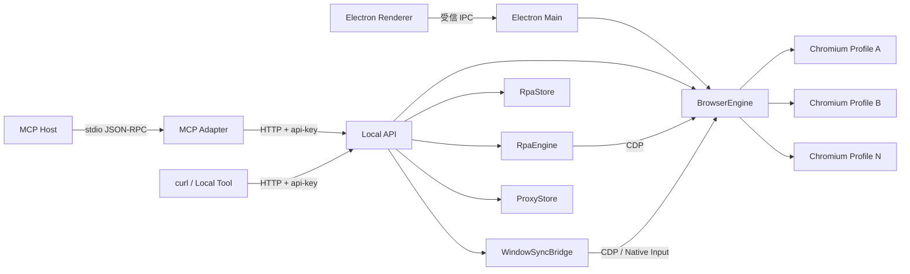
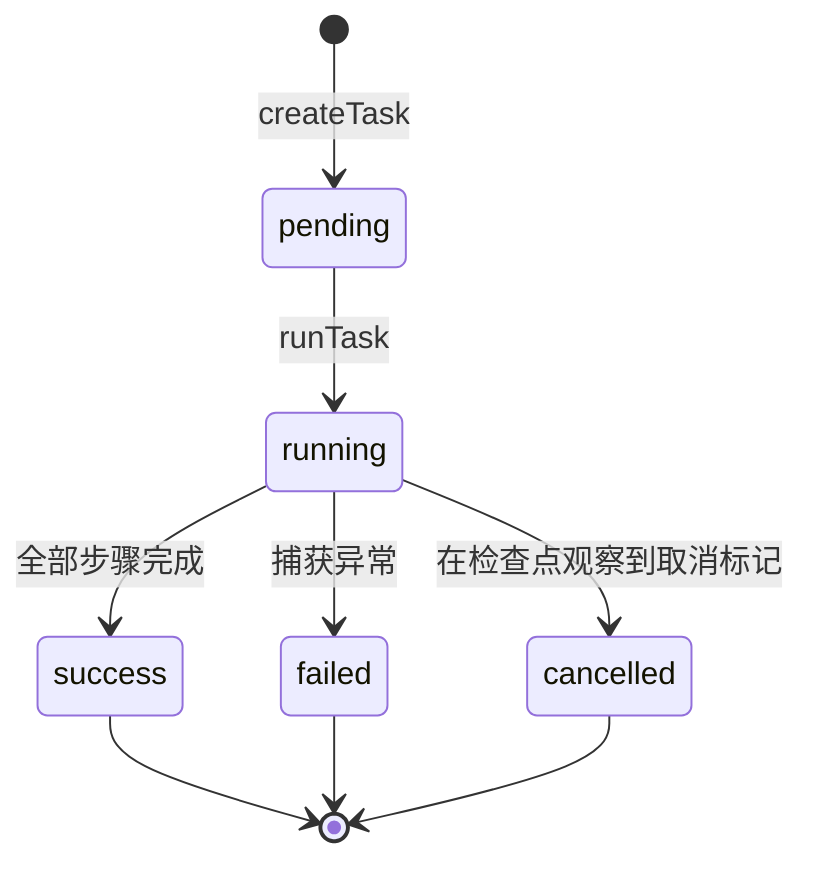

# OpenBrowser 能力与架构研究

> OpenBrowser 不是供业务代码直接 `import` 的浏览器 SDK，而是一套把隔离 Chromium Profile、代理与指纹配置、CDP、窗口同步、RPA、本地 API 和 MCP 控制面组合在一起的 Electron 桌面应用。

## 项目信息

| 字段 | 内容 |
| --- | --- |
| 上游仓库 | [lyu0805/OpenBrowser](https://github.com/lyu0805/OpenBrowser) |
| 研究基线 | [`405201583b39a90ae785193d82653f62a0ed9f91`](https://github.com/lyu0805/OpenBrowser/tree/405201583b39a90ae785193d82653f62a0ed9f91)，2026-08-29 |
| 上游版本 | `1.0.4` |
| 产品形态 | `private: true` 的 Electron 本地桌面应用，不是已发布的 npm SDK |
| 上游许可证 | 顶层源码为 [MIT](https://github.com/lyu0805/OpenBrowser/blob/405201583b39a90ae785193d82653f62a0ed9f91/LICENSE)；原生同步和浏览器内核另有第三方许可边界 |
| 研究状态 | `studying`；固定提交源码已审查，核心 Node 自测已运行，真实浏览器内核与目标网站未做端到端验收 |
| 首次研究 | `2026-08-31`（Asia/Shanghai） |
| 网页整理 | [OpenBrowser 原理与后期价值地图](https://yydshly.github.io/0831_codex_project/demos/openbrowser-architecture-lab/) |
| 标签 | `electron`、`chromium`、`profile-isolation`、`cdp`、`rpa`、`state-machine`、`mcp`、`browser-automation` |

## 证据标记

- **[已验证]**：在固定提交的本地稀疏检出上实际运行过测试或实验。
- **[源码审查]**：由固定提交的实现直接确认，但没有替上游完成真实网站、账号、代理或内核验收。
- **[上游声明]**：来自上游 README 或文档，当前研究没有独立证明全部运行效果。
- **[建议]**：本研究提出的复用、重构或安全建议，不代表上游已实现。
- **[源码审计发现]**：文档、接口或行为之间存在值得复核的不一致。

## 先给结论

**[源码审查]** OpenBrowser 的本质不是“模拟一个假的浏览器”，而是启动真实 Chromium 进程，并为每个环境分配独立 `user-data-dir`、代理、指纹配置、扩展和随机本地 CDP 端口。普通人工浏览、窗口群控、确定性 RPA 和外部 AI Agent 最终都落到同一批浏览器进程上。

它最值得技术人员研究的不是“如何规避网站识别”，而是下面这条可复用的工程主线：

```text
环境配置
  → 独立 Profile 数据目录和进程锁
  → 启动独立 Chromium
  → 发现随机 CDP 端口并建立连接
  → 应用运行时环境配置
  → 人工操作 / 窗口同步 / RPA
  → Local API
  → MCP 工具化控制
```

其中 Profile 隔离、CDP 连接、RPA DSL、轻量任务状态流和 MCP 适配层都可以迁移到合规的 QA、桌面自动化、Agent 执行器或浏览器实验平台中。指纹伪装、第三方内核和多账号运营则具有更高的合规、授权和维护风险。

## 能力总览

| 能力面 | 当前实现 | 技术入口 | 重要边界 |
| --- | --- | --- | --- |
| 多环境隔离 | 每个环境独立 Chromium `user-data-dir`、缓存目录、崩溃目录、进程锁和 CDP 端口 | [`engine.js`](https://github.com/lyu0805/OpenBrowser/blob/405201583b39a90ae785193d82653f62a0ed9f91/Browserapp/engine.js#L2201-L2354)、[`isolation.js`](https://github.com/lyu0805/OpenBrowser/blob/405201583b39a90ae785193d82653f62a0ed9f91/Browserapp/automation/isolation.js#L15-L18) | 隔离的是浏览器持久化状态，不等于网络匿名或平台身份独立 |
| 环境生命周期 | Profile 创建/更新/删除、批量启停、启动与停止屏障、异常退出清理、状态持久化恢复 | [`BrowserEngine`](https://github.com/lyu0805/OpenBrowser/blob/405201583b39a90ae785193d82653f62a0ed9f91/Browserapp/engine.js#L273-L432) | 单机内存控制器；没有远程调度器或多机资源模型 |
| 代理与出口 | HTTP/HTTPS/SOCKS、认证代理本地转发、代理库、出口 IP/国家/时区检测 | [`proxy-forwarder.js`](https://github.com/lyu0805/OpenBrowser/blob/405201583b39a90ae785193d82653f62a0ed9f91/Browserapp/proxy-forwarder.js)、[`proxy-store.js`](https://github.com/lyu0805/OpenBrowser/blob/405201583b39a90ae785193d82653f62a0ed9f91/Browserapp/automation/proxy-store.js) | 代理凭据和检测结果属于敏感数据；`read` 级 MCP 目前仍可能读取代理记录 |
| 指纹配置 | 稳定种子、UA/Client Hints、语言、时区、地理位置、CPU/内存、屏幕、Canvas、WebGL、Audio、WebRTC、字体等 | [`fingerprint.js`](https://github.com/lyu0805/OpenBrowser/blob/405201583b39a90ae785193d82653f62a0ed9f91/Browserapp/automation/fingerprint.js#L3-L17) | JS/CDP 层覆盖不等于不可检测；高级平台、传输、硬件和行为信号仍可能暴露 |
| 扩展与应用 | 本地扩展、内置扩展、按 Profile 分配、启动参数合并 | [`engine.js`](https://github.com/lyu0805/OpenBrowser/blob/405201583b39a90ae785193d82653f62a0ed9f91/Browserapp/engine.js#L3271-L3329) | 扩展自身拥有页面权限，必须单独审查来源和权限 |
| 窗口同步 | 主窗口点击、移动、滚动、键盘和标签页动作向从窗口分发；包含 CDP 与 Windows 原生输入路径 | [`live-sync-v5.js`](https://github.com/lyu0805/OpenBrowser/blob/405201583b39a90ae785193d82653f62a0ed9f91/Browserapp/live-sync-v5.js)、[`window-sync-bridge.js`](https://github.com/lyu0805/OpenBrowser/blob/405201583b39a90ae785193d82653f62a0ed9f91/Browserapp/automation/window-sync-bridge.js) | 原生窗口、弹窗、坐标缩放和浏览器版本差异会影响一致性 |
| RPA | 计划、任务、模板、变量、条件、循环、页面动作、信息提取、文件和截图步骤 | [`rpa-engine.js`](https://github.com/lyu0805/OpenBrowser/blob/405201583b39a90ae785193d82653f62a0ed9f91/Browserapp/automation/rpa-engine.js#L111-L154)、[`rpa-store.js`](https://github.com/lyu0805/OpenBrowser/blob/405201583b39a90ae785193d82653f62a0ed9f91/Browserapp/automation/rpa-store.js#L478-L577) | 基于选择器/CDP 的确定性解释器，不是自主视觉 Agent；取消和恢复语义较轻量 |
| Local API | 默认 `127.0.0.1:50325`，管理 Profile、代理、扩展、同步和 RPA | [`local-api-server.js`](https://github.com/lyu0805/OpenBrowser/blob/405201583b39a90ae785193d82653f62a0ed9f91/Browserapp/automation/local-api-server.js#L172-L263) | 单 API Key 对 Local API 是全权限；不是多租户服务端 API |
| MCP 控制面 | 50 个工具，将 MCP JSON-RPC 调用映射到 Local API；支持四级能力过滤和黑白名单 | [`mcp-server.js`](https://github.com/lyu0805/OpenBrowser/blob/405201583b39a90ae785193d82653f62a0ed9f91/Browserapp/automation/mcp-server.js#L104-L214) | MCP 默认 `admin`；权限只存在于 MCP 进程，没有下沉到 Local API token scope |
| 本地与云备份 | 本地、WebDAV、GitHub 等显式配置的备份路径 | [`cloud-sync.js`](https://github.com/lyu0805/OpenBrowser/blob/405201583b39a90ae785193d82653f62a0ed9f91/Browserapp/automation/cloud-sync.js) | 备份可能包含 Cookie、密码、2FA、代理和 Profile 数据，必须加密并使用私有存储 |

## 使用场景

### 合理且匹配

| 场景 | 为什么匹配 | 推荐约束 |
| --- | --- | --- |
| 自有系统的多租户/多账号 QA | Profile 隔离能稳定保存多组测试账号会话 | 仅使用授权测试账号；准备可清理的测试数据 |
| 地区化与设备画像测试 | 每个环境可组合代理、时区、语言、UA、分辨率和地理位置 | 记录测试矩阵；把配置视为测试数据而非真实身份 |
| 后台流程回归与页面巡检 | RPA 支持确定性步骤、变量、截图、结果和日志 | 优先对稳定内部页面使用；关键写操作增加人工确认 |
| 桌面浏览器实验平台 | 可研究 Profile 生命周期、CDP Target/Session、扩展和窗口行为 | 使用固定内核版本并建立版本兼容矩阵 |
| AI Agent 的本地浏览器执行器 | MCP 把浏览器能力变成工具，AI 负责规划，OpenBrowser 负责执行 | 默认 `read` 或精确白名单；禁止把 `admin/manage` 无条件交给模型 |
| 多窗口演示和一致操作 | 窗口排列与主从同步减少重复人工动作 | 不用于制造虚假互动或绕过平台规则 |

### 不适合或需要谨慎

- **普通个人浏览**：Chrome 多用户、无痕窗口已经足够，使用指纹浏览器会增加复杂度和风险。
- **保证过风控或保证不封号**：上游明确不保证匿名、唯一指纹、登录成功或特定网站兼容性。
- **云端浏览器池/多租户 Browser-as-a-Service**：当前控制器、本地 JSON 存储、单 API Key 和桌面进程模型都不是面向该场景设计的。
- **跨浏览器 E2E 平台**：当前聚焦桌面 Chromium，不等同于 Playwright/Selenium 的多浏览器测试矩阵。
- **无人审批的关键业务写操作**：RPA/MCP 具有删除 Profile、执行页面 JavaScript、文件操作等能力，现有控制面缺少资源级授权和人工批准机制。
- **规避账号关联、批量虚假账号、刷量或绕过封禁**：这类目标通常违反平台条款，也可能涉及法律风险；技术研究价值不能替代使用合规性。

## 架构速览



架构应分成两个平面理解：

- **控制面**：Renderer/IPC、Local API、MCP、RPA 计划与任务状态。
- **执行面**：Chromium 进程、Profile 数据目录、代理转发、CDP 会话、原生输入同步。

完整模块、数据流、启动/停止序列和持久化边界见[架构拆分](notes/architecture.md)。

## 五个关键技术专题

### 1. Profile 隔离

核心不只是给 Chrome 传一个不同目录，而是把目录安全、进程互斥、生命周期屏障、异常恢复、数据清理和隔离审计组成一个完整协议。

- `profileRoot = {profileDataRoot}/{profileId}`，Profile ID 严格限制为 ASCII 安全字符。
- 拒绝把系统 Chrome/Edge/Chromium 数据目录选成 OpenBrowser 数据根。
- 通过原子 `wx` 锁文件防止同一 Profile 被两个进程同时打开。
- 锁同时记录 Electron PID 和 Chromium PID；恢复旧锁前扫描系统进程并采用 fail-closed 策略。
- 运行时审计重复 `user-data-dir` 和 CDP 端口碰撞。
- 启动/停止用 `starting`、`running`、`stopping` Map 形成每 Profile 生命周期屏障。

详见[Profile 隔离](notes/profile-isolation.md)。

### 2. CDP 控制

项目自己实现了一个小型 CDP 客户端，而没有使用 Puppeteer：

- HTTP `/json/list`、`/json/version` 发现 Page/Browser WebSocket。
- 一次性 `call()` 适合短命令；`PersistentConnection` 支持请求 ID、超时、事件和断线清理。
- 浏览器级连接使用 `Target.setAutoAttach(flatten:true)`，在新 Page、iframe、Worker 恢复执行前应用配置。
- RPA 使用 `Page`、`Runtime`、`Input`、`Network`、`Storage` 等 domain。
- `--remote-debugging-port=0` 让 Chromium 分配随机回环端口，降低固定端口冲突和暴露。

详见[CDP 控制层](notes/cdp-control.md)。

### 3. RPA

RPA 是“步骤 DSL + 解释器 + Profile/CDP 适配器”：输入为步骤数组或兼容图数据，执行器将动作别名规范化，解析 `${variable}`，再逐步调用 CDP 或受限文件能力。

支持页面导航、点击、输入、键盘、滚动、等待、JavaScript、条件、循环、元素/列表提取、截图、CSV/Excel 类导出、Cookie、上传下载等动作。计划可针对多个 Profile 展开为多个任务并行执行。

详见[RPA 与任务状态流](notes/rpa-task-state-machine.md)。

### 4. 任务状态流

当前实现不是严格 FSM，而是手写字符串状态：



它已经具备日志、结果、变量快照、历史裁剪和存储预算，但没有严格转移校验、持久化队列、崩溃恢复租约或强制中止当前 CDP 步骤。应把它理解为本地任务记录器，而不是通用工作流引擎。

### 5. MCP 控制面

MCP 不是直接控制 Chromium，而是一个协议适配器：

```text
MCP Host
  → stdio JSON-RPC
  → mcp-server.js（工具注册 + 权限过滤 + 参数映射）
  → HTTP Local API
  → BrowserEngine / RPA / Sync / Proxy
```

这种分层让 UI、curl、MCP 共用同一业务入口，但也意味着 MCP 的 `read/run/manage/admin` 只是单进程能力过滤；拿到 Local API Key 的进程可以绕过 MCP 直接调用全部路由。

详见[MCP 控制面](notes/mcp-control-plane.md)。

## 关键源码审计发现

### 1. “复制环境不复制 Cookie/凭据”与当前实现不一致

**[源码审计发现]** 自动化文档称 duplicate 不复制 Cookie、凭据、出口检测或指纹身份；但固定提交的 duplicate 路由先 `...base` 展开源 Profile，只显式清除了部分指纹、电池、媒体字段以及两个出口时间字段。`cookies`、认证代理、`platform.password`、`totpSecret` 和部分出口字段仍可能保留。

本研究实验已复现该行为。因此在修复前，不应把“复制环境”视为天然的无会话复制，也不应把该接口无条件授予 Agent。详见[验证记录](notes/validation.md)和[复现实验](experiments/duplicate-profile-audit.js)。

### 2. MCP 权限不是 Local API 的服务端 RBAC

**[源码审查]** MCP 有 `read/run/manage/admin` 和黑白名单双检，但 Local API 只有一个全权限 API Key。`read` 级工具中还包含代理列表、任务结果等潜在敏感输出；`run` 级 RPA 可执行页面 JavaScript 和文件类动作。因此权限名称不能代替威胁建模。

### 3. RPA 状态机和取消是轻量实现

**[源码审计发现]** `stop()` 写入 cooperative cancellation Set，并立即把任务从运行 Map 移除，但不会 Abort 当前步骤。若取消发生在最后一个长步骤中，步骤结束后可能仍进入 `success`；本研究已用固定提交复现。长任务还可能超过 MCP HTTP 客户端的 60 秒超时，而浏览器侧任务继续运行。

### 4. 接口元数据与执行器存在漂移风险

**[源码审查]** MCP 工具表同时保存 method/path 元数据，但实际 dispatch 使用手写 `switch`；RPA 模板兼容检查主要验证 action type，不完整验证参数语义。随着动作和接口增加，需要契约测试或由同一声明生成 schema、路由和客户端映射。

## 成熟度判断

| 维度 | 判断 | 依据与影响 |
| --- | --- | --- |
| 功能覆盖 | 中高 | Profile、代理、指纹、扩展、同步、RPA、API、MCP 和备份已经形成完整桌面产品面 |
| 单机生命周期工程 | 中高 | 有原子锁、进程扫描、启动/停止屏障、回退和大量专项自测 |
| 模块边界 | 中 | `automation/` 已按服务拆分，但 `engine.js`、`main.js`、`renderer.js` 和 `fingerprint.js` 仍较大 |
| 自动化测试 | 中 | 固定提交包含大量 Node 自测，本研究运行的核心套件均通过；真实浏览器/网站 E2E 仍未覆盖 |
| RPA 可靠性 | 中低 | 有任务结果、日志、裁剪和并行计划，但取消、重启恢复、队列、公平性和严格状态转移不足 |
| 控制面安全 | 中 | 回环绑定、随机 Key、IPC sender 校验、CORS、body 上限等基础防护较好；单 Key 全权限、默认 MCP admin 和敏感 read 输出仍需收紧 |
| 分布式扩展性 | 低 | 本地 JSON、单 Electron 主进程和本地 Chromium，没有 worker lease、远程节点、数据库或租户模型 |
| 指纹可信度 | 不作保证 | 高级信号和目标网站策略无法仅靠源码自测证明；上游免责声明也明确不保证 |

## 可复用结论

1. **Profile 隔离要设计成协议，而不是目录命名规则。** 目录、锁、PID、进程扫描、启动停止屏障和删除前校验缺一不可。
2. **CDP 客户端应区分一次性命令和持久连接。** 前者简单，后者负责事件、Target/Session 和断线级联失败。
3. **控制面与执行面分离能提高复用性。** UI、HTTP、MCP 应调用同一服务层，不应各自直接拼 CDP 命令。
4. **RPA DSL 必须有版本、参数 schema 和契约测试。** 只校验 action 名称无法阻止模板语义漂移。
5. **任务状态不能只靠字符串字段。** 生产级实现需要合法转移、幂等、租约、超时、重试、取消信号和崩溃恢复。
6. **MCP 的工具过滤不是后端授权。** 权限必须下沉到服务端 token scope，并对敏感输出做字段级脱敏。
7. **Agent 能调用不等于 Agent 应被授权。** 删除 Profile、页面脚本、上传下载和密钥相关操作应独立批准或默认禁用。
8. **文档能力必须用行为契约守住。** “复制不带会话”等安全性质应由回归测试验证，不能只写在注释或 README 中。

## 本研究的验证范围

**[已验证]** 在 Windows 研究环境、Node.js 运行时上通过：

- `environment-audit-selftest.js`
- `automation/isolation-fingerprint-selftest.js`
- `cdp-connection-selftest.js`
- `automation/automation-selftest.js`
- `automation/local-api-profile-selftest.js`
- `automation/mcp-control-selftest.js`（本机使用未保留替代端口完成 26 项检查；默认 `50325` 属于 Windows excluded range）
- `automation/protocol/protocol-selftest.js`
- `security-hardening-selftest.js`
- 本研究新增的 duplicate 敏感字段复制实验
- 本研究新增的 RPA 最后一步取消语义实验

没有验证，因此不作成功保证：

- 实际 Wayfern/OpenBrowser/Chrome for Testing 内核启动和二进制完整性；
- 真实代理、地区化、验证码、登录和目标网站兼容性；
- Canvas/WebGL/字体/WebRTC 等面对第三方检测服务的效果；
- Windows 原生输入同步在真实多窗口中的完整行为；
- 云备份恢复、真实凭据安全和大规模数据量；
- 长时间无人值守运行和多机并发。

完整命令和结果见[验证记录](notes/validation.md)。

## 许可证与合规边界

- 顶层源码使用 MIT。
- [`THIRD-PARTY-NOTICES.md`](https://github.com/lyu0805/OpenBrowser/blob/405201583b39a90ae785193d82653f62a0ed9f91/Browserapp/THIRD-PARTY-NOTICES.md) 说明 Windows 后台输入部分适配自 AGPL-3.0 的 `chrome-power`。
- 独立浏览器内核来自 Wayfern/Donut 等第三方来源，其二进制授权不能只按顶层 MIT 理解。
- 使用账号、代理、扩展和自动化时仍须遵守目标网站条款、数据保护要求和适用法律。

**[建议]** 阅读、研究和独立实现通用架构思想，与直接复制第三方内核、规避平台控制或用于商业分发是不同决策。涉及二次分发和商业使用时，应单独核查全部组件许可证并咨询合格专业人士。

## 研究导航

- [能力、场景与边界](notes/capabilities-and-use-cases.md)
- [架构拆分](notes/architecture.md)
- [Profile 隔离](notes/profile-isolation.md)
- [CDP 控制层](notes/cdp-control.md)
- [RPA 与任务状态流](notes/rpa-task-state-machine.md)
- [MCP 控制面](notes/mcp-control-plane.md)
- [关键技术与参考实现建议](notes/key-techniques.md)
- [源码地图](notes/source-map.md)
- [验证记录](notes/validation.md)
- [Web Demo 设计契约](notes/web-demo-contract.md)
- [Web Demo 浏览器验证](notes/web-demo-validation.md)
- [在线：OpenBrowser 原理与后期价值地图](https://yydshly.github.io/0831_codex_project/demos/openbrowser-architecture-lab/)
- [实验目录](experiments/)

## 主要一手来源

- [上游中文 README](https://github.com/lyu0805/OpenBrowser/blob/405201583b39a90ae785193d82653f62a0ed9f91/README_CN.md)
- [自动化模块文档](https://github.com/lyu0805/OpenBrowser/blob/405201583b39a90ae785193d82653f62a0ed9f91/Browserapp/automation/README.md)
- [BrowserEngine](https://github.com/lyu0805/OpenBrowser/blob/405201583b39a90ae785193d82653f62a0ed9f91/Browserapp/engine.js)
- [Profile 隔离实现](https://github.com/lyu0805/OpenBrowser/blob/405201583b39a90ae785193d82653f62a0ed9f91/Browserapp/automation/isolation.js)
- [CDP 客户端](https://github.com/lyu0805/OpenBrowser/blob/405201583b39a90ae785193d82653f62a0ed9f91/Browserapp/cdp.js)
- [RPA 引擎与存储](https://github.com/lyu0805/OpenBrowser/tree/405201583b39a90ae785193d82653f62a0ed9f91/Browserapp/automation)
- [Local API](https://github.com/lyu0805/OpenBrowser/blob/405201583b39a90ae785193d82653f62a0ed9f91/Browserapp/automation/local-api-server.js)
- [MCP 服务](https://github.com/lyu0805/OpenBrowser/blob/405201583b39a90ae785193d82653f62a0ed9f91/Browserapp/automation/mcp-server.js)
- [免责声明](https://github.com/lyu0805/OpenBrowser/blob/405201583b39a90ae785193d82653f62a0ed9f91/DISCLAIMER.md)

## 变更记录

- `2026-09-01`：新增“原理与后期价值”交互网页，明确“真实 Chromium + 运行时编排”的定位、隔离边界和未来研究触发条件。
- `2026-08-31`：创建固定提交研究条目，完成能力、场景、架构、Profile 隔离、CDP、RPA、任务状态流和 MCP 控制面的首轮分析。
