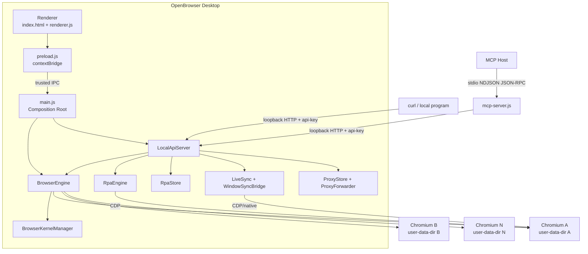
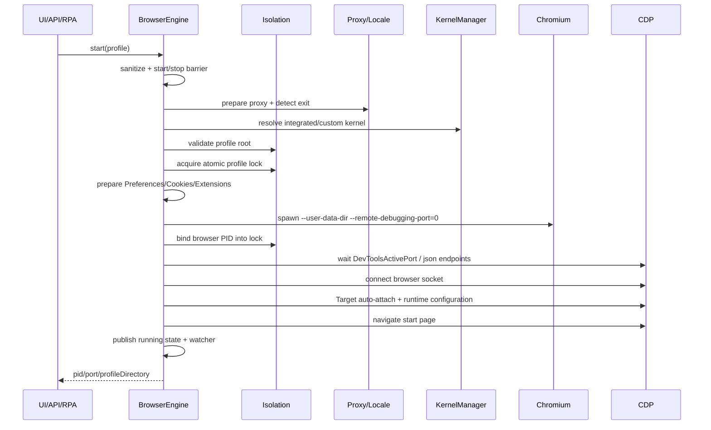
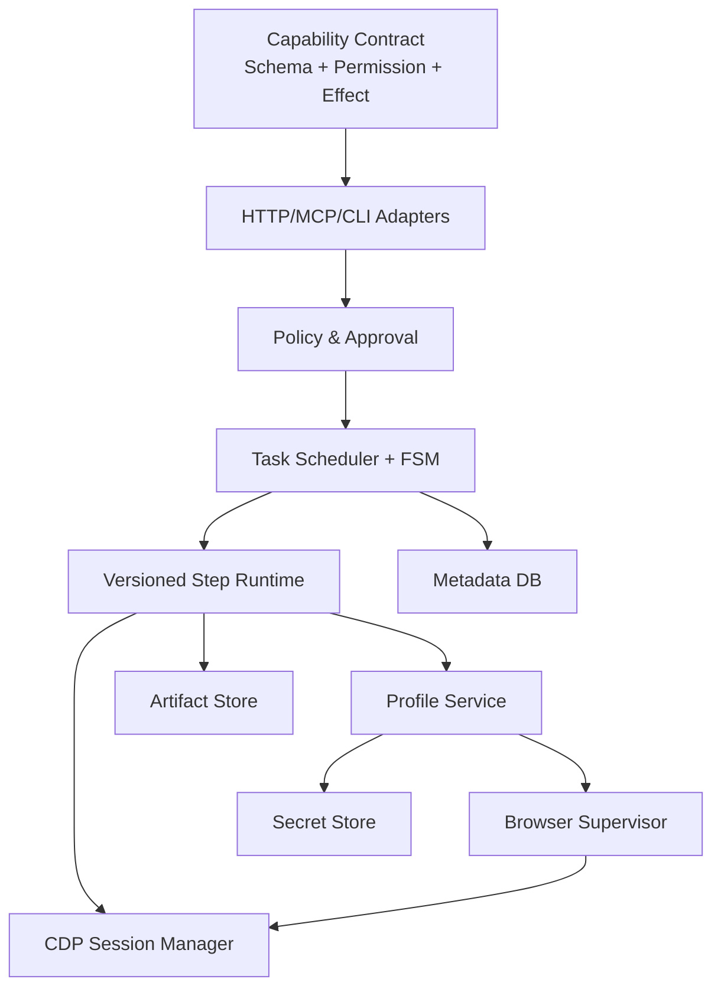

# 架构拆分

## 1. 总体视角：桌面控制器，而非浏览器库

OpenBrowser 的进程拓扑至少包含三类进程：

1. Electron 主进程：状态权威、IPC、Local API、Profile 生命周期、RPA 和同步控制；
2. Electron Renderer：本地管理界面，通过 preload 暴露的受限 IPC 调用主进程；
3. 一个或多个独立 Chromium 进程树：每个 Profile 拥有独立数据目录和 CDP 端口；
4. 可选 MCP 子进程：由 Cursor、Claude 等 MCP Host 通过 stdio 启动；
5. 可选原生 helper：Windows 输入镜像、窗口标题/快捷键等能力。



## 2. 分层与职责

### 2.1 展示层

主要文件：

- `index.html`：应用壳和页面结构；
- `renderer.js`：UI 状态、事件和表单；
- `preload.js`：通过 `contextBridge` 暴露主进程能力；
- CSS/i18n：多主题和多语言。

Electron Window 使用 `contextIsolation: true`、`nodeIntegration: false`、`sandbox: true`。主进程还校验调用方必须是唯一主窗口和规范化后的本地 `index.html` URL，再允许 IPC handler 执行。这是值得复用的 Renderer/Main 边界模式。

证据：[`main.js` BrowserWindow 配置](https://github.com/lyu0805/OpenBrowser/blob/405201583b39a90ae785193d82653f62a0ed9f91/Browserapp/main.js#L1346-L1404)与[受信 IPC sender 校验](https://github.com/lyu0805/OpenBrowser/blob/405201583b39a90ae785193d82653f62a0ed9f91/Browserapp/main.js#L799-L830)。

### 2.2 应用组合根

`main.js` 是应用级 composition root，负责：

- 设置 `userData` 根目录；
- 创建 `BrowserEngine`；
- 初始化内核、扩展、同步和 UI；
- 调用 `startAutomation()` 装配 RPA、ProxyStore、WindowSyncBridge、AppCenter 和 Local API；
- 注册 Renderer IPC；
- 应用退出时执行浏览器和自动化资源清理。

`automation/index.js` 是自动化子系统的第二个 composition root。它创建并注入相同的 `engine` 实例，确保 UI、Local API 和 RPA 操作的是同一份运行状态。

证据：[`automation/index.js`](https://github.com/lyu0805/OpenBrowser/blob/405201583b39a90ae785193d82653f62a0ed9f91/Browserapp/automation/index.js#L27-L124)。

### 2.3 浏览器领域层

`BrowserEngine` 同时承担：

- Profile 配置清洗和持久化；
- Profile 数据根安全校验；
- 内核选择和启动参数构造；
- 代理准备和出口信息回填；
- Chromium 进程启动、CDP ready 探测、运行状态和退出清理；
- 指纹构造、document-start/Worker 注入；
- Cookie 导入导出；
- 扩展加载和分配。

这使功能集中、调用方便，但也形成明显的“大服务类”：固定提交的 `engine.js` 约 3,300 行。若复用到新项目，建议拆成 `ProfileRepository`、`BrowserLauncher`、`RuntimeConfigurator`、`LifecycleSupervisor`、`ExtensionManager` 和 `NetworkResolver`。

### 2.4 自动化领域层

| 模块 | 职责 |
| --- | --- |
| `RpaEngine` | 解释步骤、自动启动 Profile、执行 CDP/文件动作、输出结果 |
| `RpaStore` | 计划、任务、模板和配置 JSON 持久化 |
| `WindowSyncBridge` | 把 Local API 参数转换成 LiveSync 调用 |
| `ProxyStore` | 代理库和检查结果持久化 |
| `AppCenter` | 扩展/应用中心的聚合视图 |
| `LocalApiServer` | 鉴权、字段归一化和 HTTP 路由 |

### 2.5 集成层

`mcp-server.js` 是独立 stdio 进程，职责只有：

1. 向 MCP Host 声明工具和 JSON Schema；
2. 依据进程策略过滤工具；
3. 将 MCP 参数映射为 Local API 请求；
4. 把 Local API JSON 包装成 MCP text content。

它不持有 BrowserEngine，也不直接执行 CDP。这种 adapter 架构降低了协议与业务耦合，是项目中最清晰的边界之一。

## 3. 控制面与执行面

### 3.1 控制面

控制面包含：

- UI/IPC；
- HTTP Local API；
- MCP 工具；
- RPA 计划、任务、模板；
- Profile 配置、扩展分配、代理库和运行状态。

控制面回答“要启动哪个环境、运行什么步骤、允许调用什么工具”。

### 3.2 执行面

执行面包含：

- Chromium 进程树；
- Profile 文件、Cookie、Cache、LocalStorage；
- CDP Page/Browser WebSocket；
- 代理 forwarder；
- 原生输入 helper；
- 页面脚本和网络请求。

执行面回答“真实浏览器怎样完成动作”。

拆分这两个平面的好处是：未来可以替换 UI、MCP 或任务存储，而不必重写浏览器启动和 CDP 层。当前实现尚未把这种边界彻底抽象成接口，但实际数据流已经呈现该结构。

## 4. Profile 启动序列



关键点：

- `start()` 用 `starting` Map 合并同一 Profile 的并发启动；
- 若存在 `stopping` Promise，新的启动必须等待清理结束；
- 锁在 spawn 前获取，Chromium PID 在 spawn 后回写；
- CDP 端口不是预分配固定端口，而从 Profile 的 `DevToolsActivePort`/端点发现；
- Profile 在 CDP ready 前不应被视为完整运行；
- 启动失败走统一资源清理路径，释放代理、连接、进程和锁。

证据：[`BrowserEngine.start/_start`](https://github.com/lyu0805/OpenBrowser/blob/405201583b39a90ae785193d82653f62a0ed9f91/Browserapp/engine.js#L2201-L2296)与[启动参数](https://github.com/lyu0805/OpenBrowser/blob/405201583b39a90ae785193d82653f62a0ed9f91/Browserapp/engine.js#L2335-L2354)。

## 5. Profile 停止序列

停止同样不是简单 `child.kill()`：

1. 等待并发启动完成；
2. 标记 `stopping` 并关闭 watcher/Worker CDP；
3. 可选导出 Cookie；
4. 优先 CDP `Browser.close`；
5. 等待进程退出；
6. 必要时终止进程树和残余 helper；
7. 关闭代理 forwarder、CDP 和原生 helper；
8. 释放带 token 的 Profile 锁；
9. 执行数据保留策略；
10. 发布状态事件。

`stopAll()` 最多进行 32 次收敛尝试，并检测 lifecycle key 是否不再变化，避免退出时无限等待。这体现了桌面浏览器进程清理的实际复杂度。

证据：[`stop/_stop/stopAll`](https://github.com/lyu0805/OpenBrowser/blob/405201583b39a90ae785193d82653f62a0ed9f91/Browserapp/engine.js#L2844-L2967)。

## 6. 持久化模型

默认数据分布如下：

```text
{Electron userData}/
├─ openbrowser-engine.json       # Profile 配置、扩展、分配、内核策略
├─ local-api-key.txt             # Local API 全权限 Key
├─ rpa-store.json                # 计划、任务、模板、结果和日志
├─ proxy-library.json            # 代理库和检查结果
├─ browser-profiles-v2/
│  └─ {profileId}/               # Chromium user-data-dir
│     ├─ Default/
│     ├─ OpenBrowserCache/
│     ├─ OpenBrowserCrashReports/
│     └─ .openbrowser-instance.lock
└─ logs/
   ├─ rpa-automation.log
   └─ browser/fingerprint diagnostics
```

### 6.1 写入策略

- Engine 状态和 API Key 使用临时文件 + rename；
- Engine 和 RPA Store 使用 Promise queue 串行化写入；
- RPA 日志在执行期间主要保存在内存，终态时落盘，减少每步重写整个 JSON；
- RPA Store 有任务数量和总字节预算；超限时先清旧终态任务，再清日志和结果 payload。

### 6.2 敏感数据边界

`openbrowser-engine.json` 可能包含 Cookie 字符串、代理认证、平台账号密码和 TOTP Secret；`proxy-library.json` 含代理凭据；`rpa-store.json` 可能含页面提取数据、日志和导出结果。

本地存储不是自动安全存储。新实现应至少考虑：

- OS keychain/credential vault；
- 分字段加密而不是只保护备份；
- 最小权限文件 ACL；
- 日志脱敏；
- Secret 不进入 Renderer、MCP read 输出或普通错误信息；
- 备份清单和恢复前风险提示。

## 7. 当前耦合与技术债

### 7.1 大文件和职责集中

`engine.js`、`main.js`、`renderer.js`、`fingerprint.js` 和 `live-sync-v5.js` 都承担较多职责。大文件不是问题本身，但会造成：

- 状态字段跨模块隐式共享；
- 生命周期异常路径难以穷举；
- 单元测试依赖内部结构；
- 新内核或新控制面接入成本高。

### 7.2 JSON Store 的单机上限

JSON + 原子 rename 适合本地个人工具，但不适合：

- 多进程同时写；
- 大量任务结果；
- 跨进程事务；
- 查询和索引；
- 崩溃后租约恢复；
- 多租户审计。

### 7.3 路由和工具表手写重复

Local API 使用长 `if` 路由，MCP 另有工具元数据和 dispatch `switch`。同一能力至少描述三遍：工具 schema、MCP 参数映射、HTTP 路由。已出现参数名和文档语义漂移，说明需要单一契约源。

## 8. 建议的目标架构

若把核心思想复用到新的合规浏览器执行平台，可以拆为：



优先重构顺序：

1. 从 `BrowserEngine` 抽出 Profile Repository 和 Browser Supervisor；
2. 统一 Local API/MCP 能力契约，生成路由、schema 和权限声明；
3. 把 RPA Task 改成显式 FSM + AbortSignal；
4. 将敏感字段迁入 Secret Store；
5. 增加 URL/文件/资源 scope 和人工批准；
6. 需要多机时再引入数据库、队列、worker lease 和远程节点。
