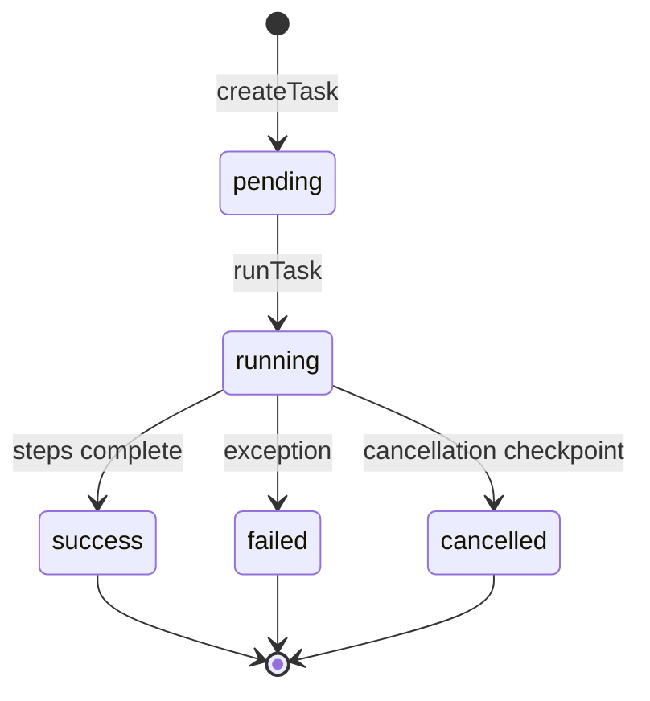
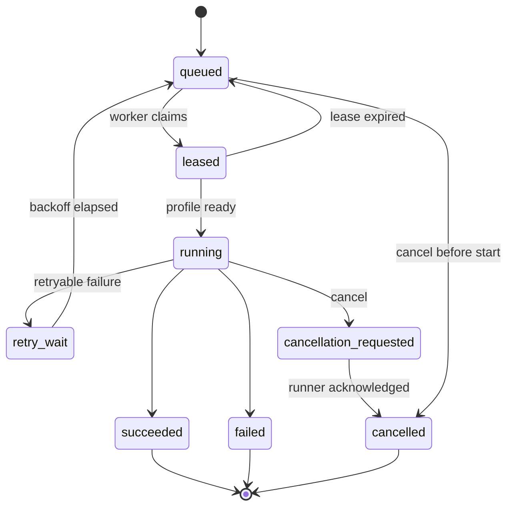

# RPA 与任务状态流

## 1. 定位：确定性解释器，不是自主 Agent

OpenBrowser RPA 接收结构化计划和步骤，以 Profile 为执行单元，解释变量、条件和动作，再调用 CDP 或本地能力。它本身不负责理解任意自然语言、视觉推理或自动修复页面流程。

```text
Plan + profile_ids + input variables
  → 为每个 Profile 创建 Task
  → 规范化动作名称和参数
  → 插值 ${variable}
  → 顺序解释 Steps
  → CDP / 文件 / Cookie / 数据处理
  → 日志、变量快照、结果与导出
```

这种设计的价值是可重复、可审计、成本可预测；代价是强依赖选择器、页面结构和明确的错误处理。

## 2. 数据对象

[`rpa-store.js`](https://github.com/lyu0805/OpenBrowser/blob/405201583b39a90ae785193d82653f62a0ed9f91/Browserapp/automation/rpa-store.js) 管理三类主要对象：

| 对象 | 作用 | 关键字段 |
| --- | --- | --- |
| Plan | 可复用的自动化定义 | `id`、`name`、`profile_ids`、`steps`、输入与元数据 |
| Task | 一次针对单个 Profile 的运行实例 | `id`、`plan_id`、`profile_id`、`status`、时间、变量、日志、结果 |
| Template | 可安装的示例/共享计划 | 模板元数据、兼容版本、步骤定义 |

Plan 是定义，Task 是运行事实。把两者分开是正确方向：修改 Plan 不应重写旧 Task，Task 应保存启动时的步骤/参数快照，才能重放和审计。

## 3. 动作 DSL

[`rpa-engine.js`](https://github.com/lyu0805/OpenBrowser/blob/405201583b39a90ae785193d82653f62a0ed9f91/Browserapp/automation/rpa-engine.js) 维护可执行动作集合，并兼容多个别名。能力大致分为：

- 浏览器：打开 URL、前进后退、刷新、新标签页、切换和关闭；
- DOM：点击、双击、悬停、输入、选择、聚焦、取文本/属性；
- 输入：键盘组合、鼠标、滚动、拖拽；
- 等待：固定时间、元素、文本、URL、页面加载；
- 数据：变量、表达式、条件、循环、列表提取、格式转换；
- 页面脚本：在页面执行 JavaScript；
- 状态：Cookie 读取/设置/清除；
- 文件：截图、上传、下载、CSV/表格类输出。

动作别名有利于兼容旧模板，但如果没有统一 schema，会产生同名不同参数、默认值漂移和静默忽略字段的问题。成熟 DSL 应为每个动作定义：

```text
action version
input schema
output schema
side-effect class
timeout / retry policy
cancellation behavior
secret fields
```

## 4. 变量与控制流

执行器支持 `${name}` 插值，步骤结果可以写回变量，后续条件、循环和输出再读取。这个模型适合固定流程，但要注意：

- 文本插值与类型化参数应区分，否则数字、布尔和对象容易被字符串化；
- 页面返回对象必须限制大小和可序列化形态；
- 表达式求值不应直接把不可信字符串交给宿主 `eval`；
- 循环必须有最大次数、最大持续时间和嵌套深度；
- 变量中的 Cookie、账号、Token 和页面内容需要脱敏策略。

## 5. 计划展开与并发

`runPlan` 为每个目标 Profile 创建一个 Task，并以 `Promise.all` 并行运行。并发模型简单直接，但它没有全局队列、每域名限流或公平调度：

```text
Plan
 ├─ Task(profile A) ── sequential steps
 ├─ Task(profile B) ── sequential steps
 └─ Task(profile C) ── sequential steps
```

在少量本地 Profile 下足够；规模增大后应增加：

- 总并发、每主机、每代理和每域名并发限制；
- 优先级与公平队列；
- 资源预检（Profile 是否运行、磁盘、下载目录、CDP 健康）；
- 启动租约和心跳，防止任务被两个 worker 同时接管；
- 背压，避免大量任务同时创建浏览器连接。

## 6. 当前状态流

当前状态由字符串和分支维护，不是带合法转移表的严格有限状态机：



优点是代码容易理解；不足是任何存储更新都可能写入任意状态，没有 compare-and-set、状态版本或幂等约束。应用崩溃后，持久化的 `running` 任务也没有租约信息来判断应恢复、失败还是重新执行。

## 7. 取消语义及实测问题

当前 `stop(taskId)` 是协作式取消：把 ID 加入 cancellation Set，并从内存 running Map 中移除。执行循环只在检查点观察这个标记，无法中止正在进行的等待、CDP 请求或页面脚本。

**[已验证]** 本研究对固定提交构造了只有一个较长 `wait` 的 Task，在该步骤执行期间调用 `stop()`。由于最后一步结束后没有再次检查取消标记，Task 最终仍被写成 `success`。复现代码见 [`rpa-cancellation-audit.js`](../experiments/rpa-cancellation-audit.js)。

这不是简单地“多加一个 if”就能完整解决。正确的取消语义需要贯穿调用链：

1. Task 创建独立 `AbortController`；
2. wait、网络、CDP、文件操作都接收 signal；
3. 每个有副作用步骤执行前后检查取消；
4. 进入终态使用原子 compare-and-set；
5. 明确定义“取消已请求”“取消中”“已取消”以及无法撤销的副作用；
6. `stop()` 等待 runner 确认，不应提前假装任务已经停止。

## 8. 超时、重试与副作用

MCP HTTP 客户端约有 60 秒请求超时，而 `/api/rpa/run` 会等待整个计划完成。结果可能是 MCP 调用方收到超时，后台任务仍继续执行。调用方若盲目重试，会重复提交具有副作用的任务。

推荐模式是异步提交：

```text
POST /runs + Idempotency-Key
  → 202 Accepted + task_ids
GET /runs/{id}
  → 状态/进度
POST /runs/{id}/cancel
  → cancellation_requested
```

重试也应按动作分类：纯读取可自动重试；导航可在条件下重试；点击“提交订单”等不可逆写操作必须依赖幂等键、业务状态核验或人工审批。

## 9. 持久化、历史和存储预算

RpaStore 采用本地 JSON 文件和串行写队列，通过临时文件/重命名方式降低部分写入风险。默认保留约 100 个终态任务，并设置约 50MB 存储预算；超限时优先裁剪旧终态任务、日志和结果，活动任务得到保留。

这种方式适合单用户桌面产品，但它不是事务数据库：

- 多进程不能安全共享同一存储；
- 查询需要加载和遍历较大 JSON；
- 崩溃恢复缺少 WAL/事务语义；
- 裁剪结果可能降低审计完整性；
- 大截图、列表和页面 HTML 不应内嵌在主状态文件。

更成熟的本地实现可以使用 SQLite：任务状态和索引进数据库，大对象进受限 artifact 目录，并为密钥/账号字段使用系统凭据库。

## 10. 接口与契约漂移

源码审查还发现几类值得用契约测试约束的问题：

- MCP `rpa_plan_save` 暴露 `plan_id`，存储更新逻辑主要识别 `id`，调用者可能以为更新，实际创建新计划；
- MCP 模板安装接口没有完整承接 `profile_ids`，而运行已安装计划又依赖目标 Profile；
- Local API 把 RPA 业务失败包在 HTTP 成功和外层 `code=0` 中，MCP 可能返回 `isError=false`，调用方必须再检查内层 `success`；
- 模板兼容检查偏重 action type，不能证明参数语义兼容。

解决方向不是在三个层各补一套判断，而是从同一动作/接口声明生成 JSON Schema、Local API 校验器、MCP 工具 schema 和测试样例。

## 11. 生产级状态机参考

可以把目标模型扩展为：



每次转移记录 `expected_state`、版本号、操作者、原因和时间；worker 用 lease/heartbeat 证明所有权；步骤保存 attempt、输入摘要、输出引用和副作用确认。这样任务状态才可以支持恢复、审计和多 worker。

## 12. 安全使用建议

- 把页面 JavaScript、Cookie、上传下载和删除动作设为高风险能力，单独授权；
- 给 RPA 设置可访问域名、URL scheme、文件根目录和最大输出大小；
- 敏感变量只传引用，执行时从凭据库按任务 scope 获取；
- 计划安装与执行分权，模板必须固定来源、版本、哈希和签名；
- 关键业务写操作在执行前展示结构化预览，由人确认；
- 日志默认脱敏，避免记录 Cookie、Authorization、密码和 TOTP。
